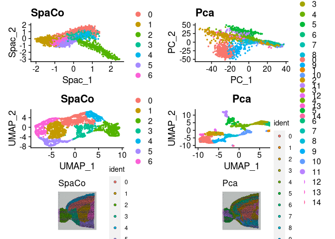
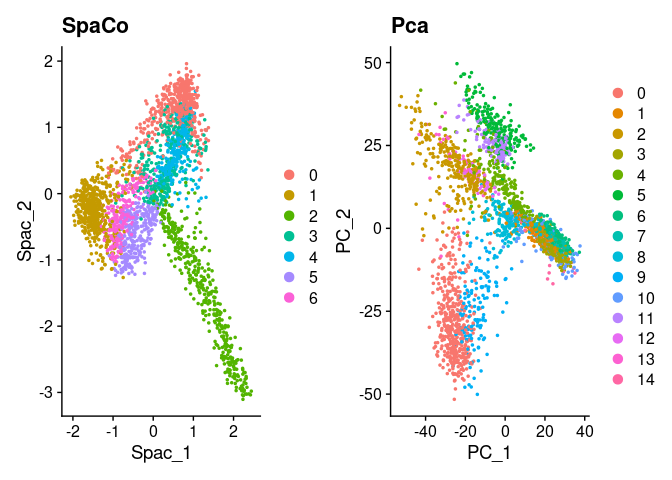
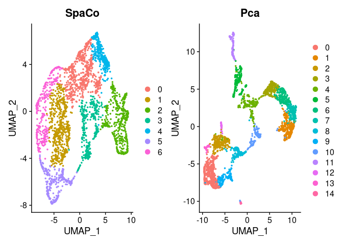
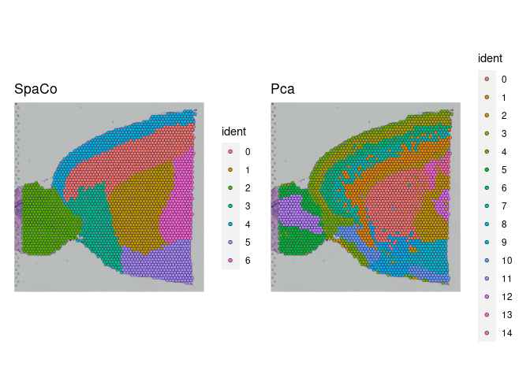

SPaCo analysis and visualisation of spatial sequencing data
================

# SPaCo guided tutorial

## Installation

This beta of SPACO is currently not yet available on Bioconductor or
CRAN. Therefore it must be installed from github via devtools.

``` r
library(devtools)
devtools::install_github("IMSBCompBio/SpaCo")
```

## Setup the SPaCo object and normalize the data.

### Setup a SPaCo object from 10x genomics Visium data.

SPACO uses the importer function of the Seurat library to import 10X
Visium spatial data. The imported data is preprocessed using Variance
Stabilizing Transformations by the sctransform package. The number
of variable features to keep can be set, as well as the variables that
should be regressed out. In our tutorial, we correct for mitochondrial
and hemoglobin genes detected in the spots.

In this tutorial, we use the [10x Mouse Brain Sagittal Anterior dataset][https://www.10xgenomics.com/datasets/mouse-brain-serial-section-1-sagittal-anterior-1-standard-1-1-0]. For SPACO, the files "Feature/barcode matrix hdf5 (filtered)" and "spatial imaging data" are necessary.

``` r
#Specify data paths
library(SPACO)

data_dir="~/path/to/directory"
slice = "~/path/to/directory/with/the/H&E/stain"
filename ="name of the feature matrix file" 
spatial_file = "name of the tissue positions list"

#Initialize the object from raw (non-normalized data and use the Seurat library for pre-processing)
SpaCoObject <- read_10x_for_spaco(data_dir = data_dir,slice = slice,filename = filename,
                                  variable_features_n = 3000,
                                  spatial_file = spatial_file,
                                  vars_to_regress = c("^mt-","^Hbb-"))
```

### Run the Spatial component analysis as dimensionality reduction and computer the number of informative spatial components.

In this step we actually do the spatial component analysis. Further, we
determine the number of relevant spatial components via sampling. These
can be found in the @nSpacs slot in the object.

``` r
SpaCoObject <- RunSCA(SpaCoObject)

SpaCoObject@nSpacs
```

    ## [1] 29

### Visualisation and denoising

We can plot the computed meta gene projections directly from the
SPaCoObject or transfer the projections right back into an existing
Seurat Object for downstream processing like clustering. In the object
they will be treated as dimensionality reduction objects. It is also
possible to plot visualize the normalized expression of specific genes
as well. All plotting functions in the SPACO library can be modified
with additional ggplot commands.

``` r
library(ggplot2)

spacplot <- Spaco_plot(SpaCoObject, spac = 1:4, ncol = NULL, combine = T)+ggtitle("Meta genes 1 to 4")
spacplot
```

<!-- -->

``` r
Ttr <- feature_plot(SpaCoObject, features = "Ttr", ncol = NULL, combine = TRUE)+ggtitle("original")
Ttr
```

<!-- -->

### Add dimension reduction information to an existing Seurat object.

First we remove all spots from the Seurat object which have no direct
neighbors as they violate SPaCo assumptions. The computed SPaCo
projections are stored in the object slot “object@reductions\[\[”spaco”\]\]”.

``` r
library(Seurat)
brain <-
  Load10X_Spatial(data.dir = data_dir,
                  slice = slice,
                  filename = filename)

brain <- subset_non_neighbour_cells(SpaCoObject, brain)

brain <- SCTransform(brain, variable.features.n = 3000,
                     assay = "Spatial")

brain <- spacs_to_seurat(SpaCoObject, brain)
```

### Use Seurat for visualisation

To compare the spatial component analysis to the analog process using
PCA in the Seurat pipeline, downstream processing is performed in
the Seurat object.

``` r
cc <- SpatialFeaturePlot(brain,features = c("Spac_1","Spac_2","Spac_3","Spac_4"),combine = T)
brain_2 <- RunPCA(brain, verbose = F)
dd <- SpatialFeaturePlot(brain_2,features = c("PC_1","PC_2","PC_3","PC_4"),combine = T)

brain <- RunUMAP(brain,reduction = "spaco",dims = 1:SpaCoObject@nSpacs,n.neighbors = 45, verbose = F)
brain_2 <- RunUMAP(brain_2,reduction = "pca",dims = 1:30, verbose = F)

brain <- FindNeighbors(brain,reduction = "spaco" , dims = 1:SpaCoObject@nSpacs, verbose = F)
brain_2 <- FindNeighbors(brain_2,reduction = "pca" , dims = 1:30, verbose = F)

brain <- FindClusters(brain,resolution = 0.24, verbose = F)
brain_2 <- FindClusters(brain_2, verbose = F)

aa <- DimPlot(brain,group.by="seurat_clusters")+ggtitle("SpaCo")
bb <- DimPlot(brain_2,group.by="seurat_clusters")+ggtitle("Pca")

a <- DimPlot(brain,reduction = "spaco")+ggtitle("SpaCo")
b <- DimPlot(brain_2,reduction = "pca")+ggtitle("Pca")

rr <- SpatialDimPlot(brain)+ggtitle("SpaCo")
qq <- SpatialDimPlot(brain_2)+ggtitle("Pca")
```

We can plot all plots using standard ggplot and patchwork grammar.

``` r
patchwork::wrap_plots(a,b,aa,bb,rr,qq,ncol=2)
```

<!-- -->

``` r
a+b
```

<!-- -->

``` r
aa+bb
```

<!-- -->

``` r
rr+qq
```

<!-- -->

### Compute spatial variable genes (SVG’s).

``` r
DE_genes<- SVGTest(SpaCoObject)
```
