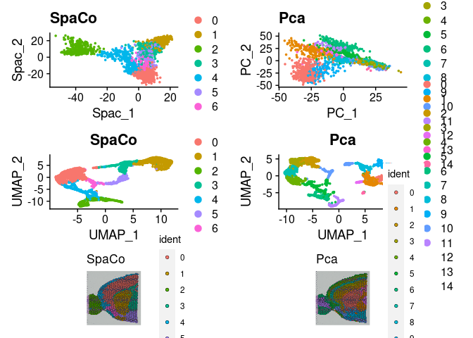
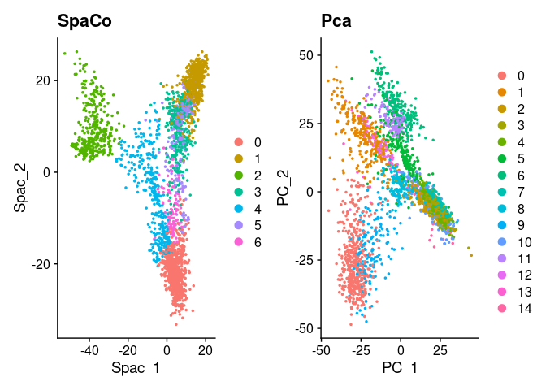
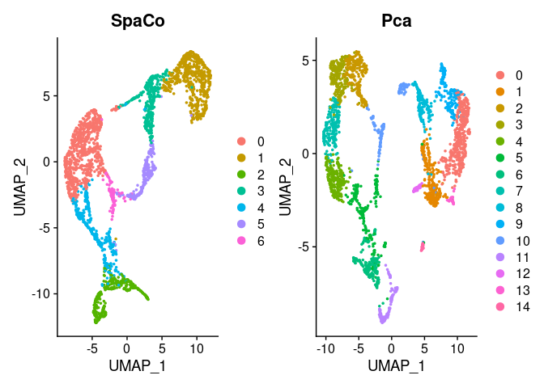
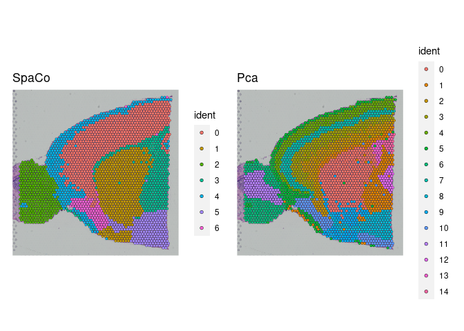

SPaCo analysis and visualisation of spatial sequencing data
================

# SPaCo guided tutorial

## Setup the SPaCo object and normalize the data.

### Setup a SPaCo object from 10x genomics Visium data.

### Setup a SPaCo object from existing Seurat object

### Run the Spatial component analysis as dimensionality reduction and computer the number of informative spatial components.

The number of relevant spatial components (spacs) is stored in the
@nSpacs slot in the SPaCoObject

``` r
SpaCoObject@nSpacs
```

    ## integer(0)

### Compute spatial variable genes (SVG’s).

``` r
DE_genes<- PValWrapperFunction_object(SpaCoObject, nSim = 1, nSpacs = 2)
```

    ## computing emprirical p-values

``` r
head(DE_genes)
```

    ##            Gene       score pVal pAdjust
    ## 1         Rgs20 0.017268698    1       1
    ## 2         Oprk1 0.017148149    1       1
    ## 3        Npbwr1 0.018992403    1       1
    ## 4          St18 0.018868867    1       1
    ## 5 3110035E14Rik 0.009302815    1       1
    ## 6 1700034P13Rik 0.019444637    1       1

###Add dimension reduction information to an existing Seurat object.
First we remove all spots from the Seurat object which have no direct
neighbors as they violate SPaCo assumptions. The computed SPaCo
projections are stored in the object slot “object\[\[”spaco”\]\]”.

``` r
brain <- SPACO::subset_non_neighbour_cells(SpaCoObject,brain)

brain <- SPACO::spacs_to_seurat(SpaCoObject,brain)
```

    ## copying projections into reduction slot spaco

``` r
patchwork::wrap_plots(a,b,aa,bb,rr,qq,ncol=2)
```

<!-- -->

``` r
a+b
```

<!-- -->

``` r
aa+bb
```

<!-- -->

``` r
rr+qq
```

<!-- -->
