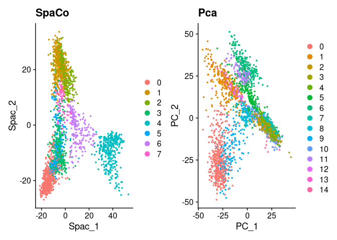

SPaCo analysis and visualisation of spatial sequencing data
================

# SPaCo guided tutorial

## Installation

This beta of SPACO is currently not yet available on Bioconductor or
CRAN. Therefore it must be installed from github via devtools.

## Setup the SPaCo object and normalize the data.

### Setup a SPaCo object from 10x genomics Visium data.

SPACO uses the importer function of the Seurat library to import 10X
Visium spatial data. The imported data is preprocessed using Variance
Stabilizing Transformations by the sctransform package (URAL) The number
of variable features to keep can be defined and any variables that
should be regressed out. In out tutorial we correct for mitochondrial
and hemoglobin genes detected in the spots

### Setup a SPaCo object from existing Seurat object

``` r
library(Seurat)
library(SPACO)
library(SeuratData)
library(ggplot2)
library(patchwork)
library(dplyr)

#install data from SeuratData
#InstallData("stxBrain")
brain <- LoadData("stxBrain", type = "anterior1")
brain <- PercentageFeatureSet(brain, pattern = "^mt-" ,col.name = "percent.mt")
brain <- PercentageFeatureSet(brain, pattern = "^Hbb-" ,col.name = "percent.hbb")
brain <- SCTransform(brain, assay = "Spatial", variable.features.n = 3000, verbose = F)

SpaCoObject <- seurat_to_spaco(Seurat = brain, assay = "SCT", n_image= 1, slot = "scale.data")
```

### Run the Spatial component analysis as dimensionality reduction and computer the number of informative spatial components.

Here we use the new implementation to compute the numer of relevant
spac’s that you can find in the @nSpacs slot. If you want to use the
standard implementation just use RunSCA and include the nSim parameter.
It’s recommended to use at least 1000 iterations. The RunSCA2 function
uses a statistical test to compute the significant spac’s but might be
less precise than the sampling approach but will have a much shorter
runtime.

``` r
SpaCoObject <- RunSCAI(SpaCoObject, PC_criterion = "percent",
                      PC_value = .8, compute_nSpacs = T,
                     compute_projections = TRUE, nSpacQuantile = 0.05, nSim = 20 )
```

    ## computing number of releveant spacs

    ## computing projections this may take a while

``` r
SpaCoObject@nSpacs
```

    ## [1] 45

``` r
#saveRDS(SpaCoObject,"~/SPACO_debugging/newSCAMoransIbrainnsim1000.RDS")
#SpaCoObject <- readRDS("~/SPACO_debugging/newSCAMoransIbrainnsim1000.RDS")
SpaCoObject@nSpacs
```

    ## [1] 45

### Visualisation and denoising

we can plot the computed meta gene projections directly from the
SPaCoObject or transfer the projections right back into an existing
Seurat Object.

``` r
spacplot <- Spaco_plot(SpaCoObject, spac = 1:4, ncol = NULL, combine = T)
```

    ## Loading required package: scales

``` r
spacplot
```

<!-- -->

``` r
SpaCoObject <-  denoise_profiles(SpaCoObject)
denoised <- denoised_projection_plot(SpaCoObject,features = "Ybx1")+ggtitle("denoised")
original <- feature_plot(SpaCoObject, features = "Ybx1", ncol = NULL, combine = TRUE)+ggtitle("original")
original+denoised
```

<!-- -->

###Add dimension reduction information to an existing Seurat object.
First we remove all spots from the Seurat object which have no direct
neighbors as they violate SPaCo assumptions. The computed SPaCo
projections are stored in the object slot “object\[\[”spaco”\]\]”.

``` r
brain <- SPACO::subset_non_neighbour_cells(SpaCoObject,brain)

brain <- SPACO::spacs_to_seurat(SpaCoObject,brain)
```

    ## copying significan projections into reduction slot spaco

### Use Seurat for visualisation

To compare the spatial component analysis to the analog in the Seurat
pipeline we do all the downstream processing right in the Seurat object.

``` r
cc <- SpatialFeaturePlot(brain,features = c("Spac_1","Spac_2","Spac_3","Spac_4"),combine = T)
brain_2 <- RunPCA(brain, verbose = F)
dd <- SpatialFeaturePlot(brain_2,features = c("PC_1","PC_2","PC_3","PC_4"),combine = T)

brain <- RunUMAP(brain,reduction = "spaco",dims = 1:SpaCoObject@nSpacs,n.neighbors = 45, verbose = F)
```

    ## Warning: The default method for RunUMAP has changed from calling Python UMAP via reticulate to the R-native UWOT using the cosine metric
    ## To use Python UMAP via reticulate, set umap.method to 'umap-learn' and metric to 'correlation'
    ## This message will be shown once per session

``` r
brain_2 <- RunUMAP(brain_2,reduction = "pca",dims = 1:30, verbose = F)

brain <- FindNeighbors(brain,reduction = "spaco" , dims = 1:5, verbose = F)
brain_2 <- FindNeighbors(brain_2,reduction = "pca" , dims = 1:30, verbose = F)

brain <- FindClusters(brain,resolution = 0.24, verbose = F)
brain_2 <- FindClusters(brain_2, verbose = F)

aa <- DimPlot(brain,group.by="seurat_clusters")+ggtitle("SpaCo")
bb <- DimPlot(brain_2,group.by="seurat_clusters")+ggtitle("Pca")
a <- DimPlot(brain,reduction = "spaco")+ggtitle("SpaCo")
b <- DimPlot(brain_2,reduction = "pca")+ggtitle("Pca")

rr <- SpatialDimPlot(brain)+ggtitle("SpaCo")
qq <- SpatialDimPlot(brain_2)+ggtitle("Pca")
```

``` r
patchwork::wrap_plots(a,b,aa,bb,rr,qq,ncol=2)
```

<!-- -->

``` r
a+b
```

<!-- -->

``` r
aa+bb
```

<!-- -->

``` r
rr+qq
```

<!-- -->

### Compute spatial variable genes (SVG’s).

``` r
DE_genes<- SVGTest(SpaCoObject)
```

    ## Loading required package: mgcv

    ## Loading required package: nlme

    ## 
    ## Attaching package: 'nlme'

    ## The following object is masked from 'package:dplyr':
    ## 
    ##     collapse

    ## This is mgcv 1.9-0. For overview type 'help("mgcv-package")'.

    ## Loading required package: CompQuadForm

``` r
head(DE_genes)
```

    ##                    score     pVal p.adjust
    ## Rgs20         0.21917877 0.000000        0
    ## Oprk1         0.24688536 0.000000        0
    ## Npbwr1        0.04620468 0.000000        0
    ## St18          0.07229480 0.000000        0
    ## 3110035E14Rik 0.74777639 0.000000        0
    ## 1700034P13Rik 0.01280162 0.781657        1

``` r
DE_genes["Ppp1r1b",]
```

    ##             score pVal p.adjust
    ## Ppp1r1b 0.9162679    0        0

### Test for Spatially variable genes

``` r
DE_genes<- SVGTest(SpaCoObject)
head(DE_genes)
```

    ##                    score     pVal p.adjust
    ## Rgs20         0.21917877 0.000000        0
    ## Oprk1         0.24688536 0.000000        0
    ## Npbwr1        0.04620468 0.000000        0
    ## St18          0.07229480 0.000000        0
    ## 3110035E14Rik 0.74777639 0.000000        0
    ## 1700034P13Rik 0.01280162 0.781657        1

``` r
DE_genes_sort <- DE_genes[order(DE_genes$score, decreasing = TRUE),]

sigs <- rownames(DE_genes[DE_genes$p.adjust<0.05,])
```

### GO-Term and KEGG pathway enrichment of spatially variable genes

``` r
library(org.Mm.eg.db)
```

    ## Loading required package: AnnotationDbi

    ## Loading required package: stats4

    ## Loading required package: BiocGenerics

    ## 
    ## Attaching package: 'BiocGenerics'

    ## The following objects are masked from 'package:dplyr':
    ## 
    ##     combine, intersect, setdiff, union

    ## The following objects are masked from 'package:stats':
    ## 
    ##     IQR, mad, sd, var, xtabs

    ## The following objects are masked from 'package:base':
    ## 
    ##     anyDuplicated, append, as.data.frame, basename, cbind, colnames,
    ##     dirname, do.call, duplicated, eval, evalq, Filter, Find, get, grep,
    ##     grepl, intersect, is.unsorted, lapply, Map, mapply, match, mget,
    ##     order, paste, pmax, pmax.int, pmin, pmin.int, Position, rank,
    ##     rbind, Reduce, rownames, sapply, setdiff, sort, table, tapply,
    ##     union, unique, unsplit, which.max, which.min

    ## Loading required package: Biobase

    ## Welcome to Bioconductor
    ## 
    ##     Vignettes contain introductory material; view with
    ##     'browseVignettes()'. To cite Bioconductor, see
    ##     'citation("Biobase")', and for packages 'citation("pkgname")'.

    ## Loading required package: IRanges

    ## Loading required package: S4Vectors

    ## 
    ## Attaching package: 'S4Vectors'

    ## The following objects are masked from 'package:dplyr':
    ## 
    ##     first, rename

    ## The following objects are masked from 'package:base':
    ## 
    ##     expand.grid, I, unname

    ## 
    ## Attaching package: 'IRanges'

    ## The following object is masked from 'package:nlme':
    ## 
    ##     collapse

    ## The following objects are masked from 'package:dplyr':
    ## 
    ##     collapse, desc, slice

    ## 
    ## Attaching package: 'AnnotationDbi'

    ## The following object is masked from 'package:dplyr':
    ## 
    ##     select

    ## 

``` r
library(clusterProfiler)
```

    ## 

    ## Registered S3 methods overwritten by 'treeio':
    ##   method              from    
    ##   MRCA.phylo          tidytree
    ##   MRCA.treedata       tidytree
    ##   Nnode.treedata      tidytree
    ##   Ntip.treedata       tidytree
    ##   ancestor.phylo      tidytree
    ##   ancestor.treedata   tidytree
    ##   child.phylo         tidytree
    ##   child.treedata      tidytree
    ##   full_join.phylo     tidytree
    ##   full_join.treedata  tidytree
    ##   groupClade.phylo    tidytree
    ##   groupClade.treedata tidytree
    ##   groupOTU.phylo      tidytree
    ##   groupOTU.treedata   tidytree
    ##   is.rooted.treedata  tidytree
    ##   nodeid.phylo        tidytree
    ##   nodeid.treedata     tidytree
    ##   nodelab.phylo       tidytree
    ##   nodelab.treedata    tidytree
    ##   offspring.phylo     tidytree
    ##   offspring.treedata  tidytree
    ##   parent.phylo        tidytree
    ##   parent.treedata     tidytree
    ##   root.treedata       tidytree
    ##   rootnode.phylo      tidytree
    ##   sibling.phylo       tidytree

    ## Registered S3 method overwritten by 'ggtree':
    ##   method      from 
    ##   identify.gg ggfun

    ## clusterProfiler v4.2.2  For help: https://yulab-smu.top/biomedical-knowledge-mining-book/
    ## 
    ## If you use clusterProfiler in published research, please cite:
    ## T Wu, E Hu, S Xu, M Chen, P Guo, Z Dai, T Feng, L Zhou, W Tang, L Zhan, X Fu, S Liu, X Bo, and G Yu. clusterProfiler 4.0: A universal enrichment tool for interpreting omics data. The Innovation. 2021, 2(3):100141

    ## 
    ## Attaching package: 'clusterProfiler'

    ## The following object is masked from 'package:AnnotationDbi':
    ## 
    ##     select

    ## The following object is masked from 'package:IRanges':
    ## 
    ##     slice

    ## The following object is masked from 'package:S4Vectors':
    ## 
    ##     rename

    ## The following object is masked from 'package:stats':
    ## 
    ##     filter

``` r
sigs_entres <- na.omit(AnnotationDbi::select(
  x = org.Mm.eg.db,
  keys = sigs,
  keytype = "SYMBOL",
  columns = c("ENTREZID"))[,"ENTREZID"])
```

    ## 'select()' returned 1:1 mapping between keys and columns

``` r
enrichGO(sigs_entres,'org.Mm.eg.db',ont="BP") -> GOBP
dotplot_brain <- dotplot(GOBP, showCategory=10)
dotplot_brain
```

<!-- -->
