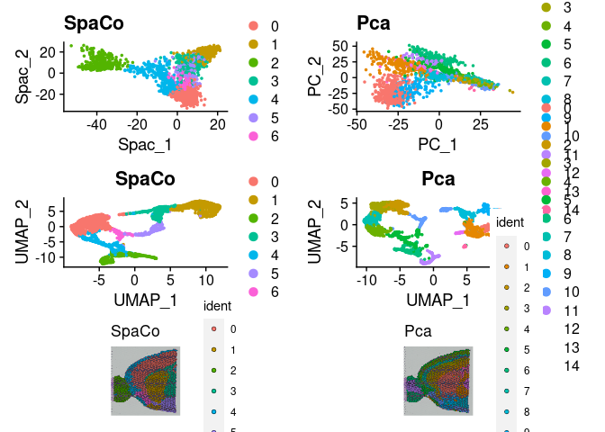
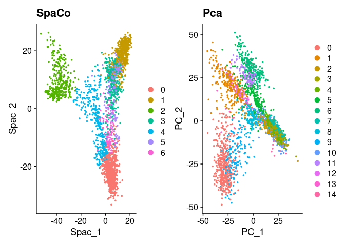
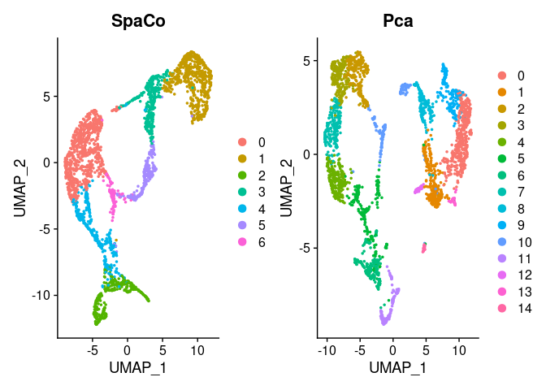
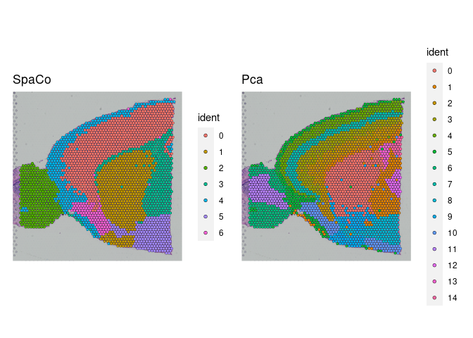

Spaco_vignette
================

# SPaCo guided tutorial

## Setup the SPaCo object

### Setup a SPaCo object from 10x genomics Visium data

``` r
#Specify data paths
devtools::load_all("~/SPACO")
```

    ## ℹ Loading SPACO

``` r
data_dir="~/Liver_Organoid_project/scRNA_spatial_tissue/VX03_A006200136/cellranger/141895/outs"

slice = "~/Liver_Organoid_project/scRNA_spatial_tissue/VX03_A006200136/cellranger/141895/outs/spatial"

filename ="filtered_feature_bc_matrix.h5"

spatial_file = "tissue_positions_list.csv"

#Initialize the object from raw (non-normalised data and use the Seurat library for pre-processing)
SpaCoObject <- read_10x_for_spaco(data_dir = data_dir,slice = slice,filename =filename,variable_features_n = 3000,
                                  spatial_file = spatial_file, vars_to_regress = c("^mt-","^Hbb-"))
```

    ## Loading required package: Seurat
    ## Attaching SeuratObject
    ## Calculating cell attributes from input UMI matrix: log_umi
    ## Variance stabilizing transformation of count matrix of size 13816 by 1596
    ## Model formula is y ~ log_umi
    ## Get Negative Binomial regression parameters per gene
    ## Using 2000 genes, 1596 cells

    ##   |                                                                              |                                                                      |   0%  |                                                                              |==================                                                    |  25%  |                                                                              |===================================                                   |  50%  |                                                                              |====================================================                  |  75%  |                                                                              |======================================================================| 100%

    ## Found 76 outliers - those will be ignored in fitting/regularization step
    ## 
    ## Second step: Get residuals using fitted parameters for 13816 genes

    ##   |                                                                              |                                                                      |   0%  |                                                                              |==                                                                    |   4%  |                                                                              |=====                                                                 |   7%  |                                                                              |========                                                              |  11%  |                                                                              |==========                                                            |  14%  |                                                                              |============                                                          |  18%  |                                                                              |===============                                                       |  21%  |                                                                              |==================                                                    |  25%  |                                                                              |====================                                                  |  29%  |                                                                              |======================                                                |  32%  |                                                                              |=========================                                             |  36%  |                                                                              |============================                                          |  39%  |                                                                              |==============================                                        |  43%  |                                                                              |================================                                      |  46%  |                                                                              |===================================                                   |  50%  |                                                                              |======================================                                |  54%  |                                                                              |========================================                              |  57%  |                                                                              |==========================================                            |  61%  |                                                                              |=============================================                         |  64%  |                                                                              |================================================                      |  68%  |                                                                              |==================================================                    |  71%  |                                                                              |====================================================                  |  75%  |                                                                              |=======================================================               |  79%  |                                                                              |==========================================================            |  82%  |                                                                              |============================================================          |  86%  |                                                                              |==============================================================        |  89%  |                                                                              |=================================================================     |  93%  |                                                                              |====================================================================  |  96%  |                                                                              |======================================================================| 100%

    ## Computing corrected count matrix for 13816 genes

    ##   |                                                                              |                                                                      |   0%  |                                                                              |==                                                                    |   4%  |                                                                              |=====                                                                 |   7%  |                                                                              |========                                                              |  11%  |                                                                              |==========                                                            |  14%  |                                                                              |============                                                          |  18%  |                                                                              |===============                                                       |  21%  |                                                                              |==================                                                    |  25%  |                                                                              |====================                                                  |  29%  |                                                                              |======================                                                |  32%  |                                                                              |=========================                                             |  36%  |                                                                              |============================                                          |  39%  |                                                                              |==============================                                        |  43%  |                                                                              |================================                                      |  46%  |                                                                              |===================================                                   |  50%  |                                                                              |======================================                                |  54%  |                                                                              |========================================                              |  57%  |                                                                              |==========================================                            |  61%  |                                                                              |=============================================                         |  64%  |                                                                              |================================================                      |  68%  |                                                                              |==================================================                    |  71%  |                                                                              |====================================================                  |  75%  |                                                                              |=======================================================               |  79%  |                                                                              |==========================================================            |  82%  |                                                                              |============================================================          |  86%  |                                                                              |==============================================================        |  89%  |                                                                              |=================================================================     |  93%  |                                                                              |====================================================================  |  96%  |                                                                              |======================================================================| 100%

    ## Calculating gene attributes
    ## Wall clock passed: Time difference of 29.58749 secs
    ## Determine variable features
    ## Place corrected count matrix in counts slot
    ## Regressing out percent.mt., percent.Hbb.
    ## Centering data matrix
    ## Set default assay to SCT
    ## removing cells without any neighbours in defined distance

### Setup a SPaCo object from existing Seurat object

``` r
library(Seurat)
library(SeuratData)
```

    ## ── Installed datasets ───────────────────────────────────── SeuratData v0.2.2 ──

    ## ✔ stxBrain 0.1.1

    ## ────────────────────────────────────── Key ─────────────────────────────────────

    ## ✔ Dataset loaded successfully
    ## ❯ Dataset built with a newer version of Seurat than installed
    ## ❓ Unknown version of Seurat installed

``` r
library(ggplot2)
library(patchwork)
library(dplyr)
```

    ## 
    ## Attaching package: 'dplyr'

    ## The following objects are masked from 'package:stats':
    ## 
    ##     filter, lag

    ## The following objects are masked from 'package:base':
    ## 
    ##     intersect, setdiff, setequal, union

``` r
#install data from SeuratData
InstallData("stxBrain")
```

    ## Warning: The following packages are already installed and will not be
    ## reinstalled: stxBrain

``` r
brain <- LoadData("stxBrain", type = "anterior1")
brain <- PercentageFeatureSet(brain, pattern = "^mt-" ,col.name = "percent.mt")
brain <- PercentageFeatureSet(brain, pattern = "^Hbb-" ,col.name = "percent.hbb")
brain <- SCTransform(brain, assay = "Spatial", variable.features.n = 3000, vars.to.regress = c("percent.mt","percent.hbb"))
```

    ## Calculating cell attributes from input UMI matrix: log_umi

    ## Variance stabilizing transformation of count matrix of size 17668 by 2696

    ## Model formula is y ~ log_umi

    ## Get Negative Binomial regression parameters per gene

    ## Using 2000 genes, 2696 cells

    ##   |                                                                              |                                                                      |   0%  |                                                                              |==================                                                    |  25%  |                                                                              |===================================                                   |  50%  |                                                                              |====================================================                  |  75%  |                                                                              |======================================================================| 100%

    ## Found 90 outliers - those will be ignored in fitting/regularization step

    ## Second step: Get residuals using fitted parameters for 17668 genes

    ##   |                                                                              |                                                                      |   0%  |                                                                              |==                                                                    |   3%  |                                                                              |====                                                                  |   6%  |                                                                              |======                                                                |   8%  |                                                                              |========                                                              |  11%  |                                                                              |==========                                                            |  14%  |                                                                              |============                                                          |  17%  |                                                                              |==============                                                        |  19%  |                                                                              |================                                                      |  22%  |                                                                              |==================                                                    |  25%  |                                                                              |===================                                                   |  28%  |                                                                              |=====================                                                 |  31%  |                                                                              |=======================                                               |  33%  |                                                                              |=========================                                             |  36%  |                                                                              |===========================                                           |  39%  |                                                                              |=============================                                         |  42%  |                                                                              |===============================                                       |  44%  |                                                                              |=================================                                     |  47%  |                                                                              |===================================                                   |  50%  |                                                                              |=====================================                                 |  53%  |                                                                              |=======================================                               |  56%  |                                                                              |=========================================                             |  58%  |                                                                              |===========================================                           |  61%  |                                                                              |=============================================                         |  64%  |                                                                              |===============================================                       |  67%  |                                                                              |=================================================                     |  69%  |                                                                              |===================================================                   |  72%  |                                                                              |====================================================                  |  75%  |                                                                              |======================================================                |  78%  |                                                                              |========================================================              |  81%  |                                                                              |==========================================================            |  83%  |                                                                              |============================================================          |  86%  |                                                                              |==============================================================        |  89%  |                                                                              |================================================================      |  92%  |                                                                              |==================================================================    |  94%  |                                                                              |====================================================================  |  97%  |                                                                              |======================================================================| 100%

    ## Computing corrected count matrix for 17668 genes

    ##   |                                                                              |                                                                      |   0%  |                                                                              |==                                                                    |   3%  |                                                                              |====                                                                  |   6%  |                                                                              |======                                                                |   8%  |                                                                              |========                                                              |  11%  |                                                                              |==========                                                            |  14%  |                                                                              |============                                                          |  17%  |                                                                              |==============                                                        |  19%  |                                                                              |================                                                      |  22%  |                                                                              |==================                                                    |  25%  |                                                                              |===================                                                   |  28%  |                                                                              |=====================                                                 |  31%  |                                                                              |=======================                                               |  33%  |                                                                              |=========================                                             |  36%  |                                                                              |===========================                                           |  39%  |                                                                              |=============================                                         |  42%  |                                                                              |===============================                                       |  44%  |                                                                              |=================================                                     |  47%  |                                                                              |===================================                                   |  50%  |                                                                              |=====================================                                 |  53%  |                                                                              |=======================================                               |  56%  |                                                                              |=========================================                             |  58%  |                                                                              |===========================================                           |  61%  |                                                                              |=============================================                         |  64%  |                                                                              |===============================================                       |  67%  |                                                                              |=================================================                     |  69%  |                                                                              |===================================================                   |  72%  |                                                                              |====================================================                  |  75%  |                                                                              |======================================================                |  78%  |                                                                              |========================================================              |  81%  |                                                                              |==========================================================            |  83%  |                                                                              |============================================================          |  86%  |                                                                              |==============================================================        |  89%  |                                                                              |================================================================      |  92%  |                                                                              |==================================================================    |  94%  |                                                                              |====================================================================  |  97%  |                                                                              |======================================================================| 100%

    ## Calculating gene attributes

    ## Wall clock passed: Time difference of 43.69845 secs

    ## Determine variable features

    ## Place corrected count matrix in counts slot

    ## Regressing out percent.mt, percent.hbb

    ## Centering data matrix

    ## Set default assay to SCT

``` r
SpaCoObject <- seurat_to_spaco(Seurat = brain, assay = "SCT", n_image= 1, slot = "scale.data")
```

### Run the Spatial component analysis as dimensionality reduction and computer the number of informative spatial components.

###Compute spatial variable genes (SVG’s).

``` r
SpaCoObject@nSpacs
```

    ## [1] 33

``` r
DE_genes<- PValWrapperFunction_object(SpaCoObject, nSim = 1, nSpacs = SpaCoObject@nSpacs)
```

    ## computing emprirical p-values

``` r
DE_genes
```

    ##                Gene       score pVal pAdjust
    ## 1             Rgs20 0.016902875    1       1
    ## 2             Oprk1 0.016823564    1       1
    ## 3            Npbwr1 0.019392046    1       1
    ## 4              St18 0.018970674    1       1
    ## 5     3110035E14Rik 0.008063688    1       1
    ## 6     1700034P13Rik 0.020143366    1       1
    ## 7             Tcf24 0.019842844    1       1
    ## 8              Cpa6 0.016190464    1       1
    ## 9             Sulf1 0.014240185    1       1
    ## 10          Slco5a1 0.017486293    1       1
    ## 11            Kcnb2 0.016516230    1       1
    ## 12           Tfap2b 0.015852317    1       1
    ## 13    6720483E21Rik 0.020098607    1       1
    ## 14            Paqr8 0.017936338    1       1
    ## 15            Tram2 0.019596019    1       1
    ## 16           Fer1l5 0.019812568    1       1
    ## 17          Fam178b 0.019960004    1       1
    ## 18    2010300C02Rik 0.013868904    1       1
    ## 19              Nms 0.018739231    1       1
    ## 20           Tbc1d8 0.015132824    1       1
    ## 21           Map4k4 0.017820778    1       1
    ## 22           Il1rl1 0.020243473    1       1
    ## 23           Slc9a4 0.016370202    1       1
    ## 24          Gm29260 0.019707408    1       1
    ## 25           Pantr1 0.017424969    1       1
    ## 26             Fhl2 0.015498748    1       1
    ## 27    1500015O10Rik 0.010887787    1       1
    ## 28           Col3a1 0.017239039    1       1
    ## 29           Col5a2 0.017697388    1       1
    ## 30           Tmeff2 0.017137347    1       1
    ## 31           Cavin2 0.018774913    1       1
    ## 32              Gls 0.015266656    1       1
    ## 33            Rftn2 0.019026667    1       1
    ## 34            Plcl1 0.018520227    1       1
    ## 35            Satb2 0.015302991    1       1
    ## 36            Casp8 0.019268977    1       1
    ## 37            Trak2 0.017922803    1       1
    ## 38            Cdk15 0.019579328    1       1
    ## 39            Gm973 0.019204982    1       1
    ## 40    9530026F06Rik 0.019941352    1       1
    ## 41             Nrp2 0.015092877    1       1
    ## 42             Fzd5 0.019740747    1       1
    ## 43           Spag16 0.019244981    1       1
    ## 44              Fn1 0.014800823    1       1
    ## 45           Igfbp2 0.011094037    1       1
    ## 46           Igfbp5 0.013835259    1       1
    ## 47    6030407O03Rik 0.019946214    1       1
    ## 48           Tmbim1 0.016299001    1       1
    ## 49          Cyp27a1 0.019040011    1       1
    ## 50             Wnt6 0.013891836    1       1
    ## 51           Tuba4a 0.012657160    1       1
    ## 52           Dnajb2 0.017291756    1       1
    ## 53           Resp18 0.011116921    1       1
    ## 54            Asic4 0.014733417    1       1
    ## 55          Gm17751 0.020407301    1       1
    ## 56            Epha4 0.014584443    1       1
    ## 57            Sgpp2 0.017804937    1       1
    ## 58             Scg2 0.011200342    1       1
    ## 59         Serpine2 0.014077883    1       1
    ## 60           Dock10 0.016690618    1       1
    ## 61           Col4a4 0.018962328    1       1
    ## 62           Sphkap 0.015756432    1       1
    ## 63             Pid1 0.017073763    1       1
    ## 64             Dner 0.012530128    1       1
    ## 65    C130026I21Rik 0.020572656    1       1
    ## 66            Itm2c 0.013937014    1       1
    ## 67           Spata3 0.019490264    1       1
    ## 68             Ptma 0.011399521    1       1
    ## 69            Ecel1 0.014914580    1       1
    ## 70           Prss56 0.016447817    1       1
    ## 71            Efhd1 0.016966458    1       1
    ## 72           Kcnj13 0.012788119    1       1
    ## 73             Ngef 0.009889578    1       1
    ## 74             Spp2 0.016898994    1       1
    ## 75          Gm29538 0.015357729    1       1
    ## 76             Gbx2 0.018835748    1       1
    ## 77             Iqca 0.019453078    1       1
    ## 78           Col6a3 0.018657114    1       1
    ## 79           Klhl30 0.018306560    1       1
    ## 80             Otos 0.018933620    1       1
    ## 81           Crocc2 0.018641238    1       1
    ## 82            Sned1 0.017424303    1       1
    ## 83              Bok 0.015257008    1       1
    ## 84             Neu4 0.019488642    1       1
    ## 85           Gm7967 0.020619312    1       1
    ## 86            Cdh20 0.018747759    1       1
    ## 87           Phlpp1 0.017194790    1       1
    ## 88            Cdh19 0.017985525    1       1
    ## 89    9330185C12Rik 0.019899883    1       1
    ## 90          Cfap221 0.019119475    1       1
    ## 91             Sctr 0.019953608    1       1
    ## 92              Dbi 0.008580577    1       1
    ## 93              En1 0.020382716    1       1
    ## 94            Htr5b 0.019007860    1       1
    ## 95            Dpp10 0.015315252    1       1
    ## 96            Lypd1 0.011254135    1       1
    ## 97          Tmem163 0.015584476    1       1
    ## 98           R3hdm1 0.015448833    1       1
    ## 99            Cxcr4 0.017054109    1       1
    ## 100         Gm16083 0.019802894    1       1
    ## 101           Rab7b 0.019610086    1       1
    ## 102          Pm20d1 0.019918099    1       1
    ## 103         Slc45a3 0.018714669    1       1
    ## 104           Cdk18 0.016935301    1       1
    ## 105         Klhdc8a 0.016440879    1       1
    ## 106           Cntn2 0.017123837    1       1
    ## 107           Nfasc 0.018124727    1       1
    ## 108         Gm19461 0.020190132    1       1
    ## 109          Atp2b4 0.013152470    1       1
    ## 110           Prelp 0.015609979    1       1
    ## 111            Fmod 0.012660755    1       1
    ## 112           Chit1 0.020027259    1       1
    ## 113            Syt2 0.015528064    1       1
    ## 114        Ppp1r12b 0.012326981    1       1
    ## 115            Lgr6 0.011608033    1       1
    ## 116         Gpr37l1 0.015416602    1       1
    ## 117           Lmod1 0.018749274    1       1
    ## 118          Shisa4 0.016288583    1       1
    ## 119           Csrp1 0.011145739    1       1
    ## 120          Phlda3 0.017998092    1       1
    ## 121           Tnni1 0.018765911    1       1
    ## 122           Igfn1 0.015329557    1       1
    ## 123           Mroh3 0.019888128    1       1
    ## 124             Cfh 0.016377298    1       1
    ## 125         B3galt2 0.016273905    1       1
    ## 126            Rgs2 0.016126474    1       1
    ## 127         Pla2g4a 0.019259929    1       1
    ## 128            Prg4 0.015012837    1       1
    ## 129        Ivns1abp 0.014705181    1       1
    ## 130         Fam129a 0.019841350    1       1
    ## 131           Lamc1 0.018566214    1       1
    ## 132            Rgs8 0.015796624    1       1
    ## 133            Glul 0.012159744    1       1
    ## 134            Ier5 0.015712088    1       1
    ## 135             Mr1 0.019097784    1       1
    ## 136           Nphs2 0.018504649    1       1
    ## 137          Axdnd1 0.019469487    1       1
    ## 138            Abl2 0.016085030    1       1
    ## 139          Pappa2 0.017690351    1       1
    ## 140           Prdx6 0.014618349    1       1
    ## 141            Myoc 0.013607951    1       1
    ## 142            Fmo1 0.014478689    1       1
    ## 143            Fmo2 0.019228990    1       1
    ## 144         Gm16548 0.019420281    1       1
    ## 145              F5 0.012388966    1       1
    ## 146            Nme7 0.017995514    1       1
    ## 147          Atp1b1 0.009057419    1       1
    ## 148           Mpzl1 0.019185339    1       1
    ## 149           Cd247 0.019976077    1       1
    ## 150           Ildr2 0.016237262    1       1
    ## 151            Pogk 0.019320064    1       1
    ## 152           Mgst3 0.015266678    1       1
    ## 153            Rxrg 0.011243647    1       1
    ## 154           Lmx1a 0.018112906    1       1
    ## 155            Pbx1 0.013645649    1       1
    ## 156            Nuf2 0.019370274    1       1
    ## 157            Rgs5 0.018005584    1       1
    ## 158            Rgs4 0.010222909    1       1
    ## 159            Ddr2 0.017905143    1       1
    ## 160         Olfml2b 0.017295862    1       1
    ## 161           Fcgr4 0.020003376    1       1
    ## 162           Fcgr3 0.018851415    1       1
    ## 163         Cfap126 0.015167685    1       1
    ## 164          Pcp4l1 0.007138551    1       1
    ## 165          Fcer1g 0.018941841    1       1
    ## 166         Adamts4 0.019523266    1       1
    ## 167           Tstd1 0.017860668    1       1
    ## 168          Pea15a 0.014701955    1       1
    ## 169           Casq1 0.019643937    1       1
    ## 170          Atp1a2 0.010317104    1       1
    ## 171           Kcnj9 0.015428845    1       1
    ## 172          Kcnj10 0.014911363    1       1
    ## 173          Ifi213 0.018677983    1       1
    ## 174             Kmo 0.018769582    1       1
    ## 175          Zbtb18 0.011944086    1       1
    ## 176          Sccpdh 0.016964704    1       1
    ## 177           Itpkb 0.018379028    1       1
    ## 178           H3f3a 0.012224984    1       1
    ## 179          Lefty1 0.016652954    1       1
    ## 180         Tmem63a 0.015047373    1       1
    ## 181           Ephx1 0.017266852    1       1
    ## 182           Cnih3 0.015324089    1       1
    ## 183          Dnah14 0.019751367    1       1
    ## 184   1700047M11Rik 0.017704205    1       1
    ## 185        Trp53bp2 0.018172075    1       1
    ## 186         Gm33973 0.019888001    1       1
    ## 187   9630028B13Rik 0.018735369    1       1
    ## 188           Tgfb2 0.017546261    1       1
    ## 189           Esrrg 0.016792618    1       1
    ## 190           Kcnk2 0.015264843    1       1
    ## 191          Ptpn14 0.017436000    1       1
    ## 192           Smyd2 0.016556624    1       1
    ## 193           Prox1 0.018621840    1       1
    ## 194         Prox1os 0.019350041    1       1
    ## 195         Spata45 0.020185585    1       1
    ## 196   D730003I15Rik 0.019796797    1       1
    ## 197             Rd3 0.016791415    1       1
    ## 198            Cd34 0.015834660    1       1
    ## 199         Gm16897 0.020347007    1       1
    ## 200           Acbd7 0.018290100    1       1
    ## 201           Meig1 0.019018847    1       1
    ## 202            Ucma 0.019534871    1       1
    ## 203         Gm13389 0.019695120    1       1
    ## 204           Itih2 0.016948409    1       1
    ## 205           Itih5 0.018190730    1       1
    ## 206           Prkcq 0.018859480    1       1
    ## 207         Gm13293 0.019915988    1       1
    ## 208           C1ql3 0.017209097    1       1
    ## 209             Vim 0.013685053    1       1
    ## 210            Mrc1 0.017392317    1       1
    ## 211        Slc39a12 0.018358352    1       1
    ## 212          Plxdc2 0.019182251    1       1
    ## 213         Pip4k2a 0.017469064    1       1
    ## 214            Etl4 0.017131297    1       1
    ## 215           Enkur 0.019037901    1       1
    ## 216          Gpr158 0.015709077    1       1
    ## 217            Gad2 0.010645698    1       1
    ## 218            Nsmf 0.015173682    1       1
    ## 219           Nrarp 0.016859717    1       1
    ## 220         Fam166a 0.020080873    1       1
    ## 221         Slc34a3 0.020197436    1       1
    ## 222            Tprn 0.017740186    1       1
    ## 223        AA543186 0.020438716    1       1
    ## 224          Entpd2 0.018920750    1       1
    ## 225           Abca2 0.016067153    1       1
    ## 226           Clic3 0.017990276    1       1
    ## 227           Ptgds 0.008655257    1       1
    ## 228         Gm26702 0.020173105    1       1
    ## 229            Fcna 0.019894754    1       1
    ## 230           Nacc2 0.015819483    1       1
    ## 231         Ccdc187 0.017666350    1       1
    ## 232           Gpsm1 0.008010142    1       1
    ## 233           Card9 0.019635282    1       1
    ## 234         Fam163b 0.013435190    1       1
    ## 235          Col5a1 0.018075787    1       1
    ## 236           Olfm1 0.006104010    1       1
    ## 237          Spaca9 0.018572670    1       1
    ## 238            Pkn3 0.019707775    1       1
    ## 239           Fnbp1 0.016702499    1       1
    ## 240            Ass1 0.017773867    1       1
    ## 241          Fibcd1 0.017212818    1       1
    ## 242           Aif1l 0.018647912    1       1
    ## 243            Dnm1 0.010711564    1       1
    ## 244   1110008P14Rik 0.008574408    1       1
    ## 245            Lcn2 0.018285275    1       1
    ## 246           Ttc16 0.019298799    1       1
    ## 247          Stxbp1 0.013598395    1       1
    ## 248          Garnl3 0.015358574    1       1
    ## 249         Angptl2 0.017766429    1       1
    ## 250           Lmx1b 0.018367789    1       1
    ## 251            Pbx3 0.010731730    1       1
    ## 252           Cutal 0.019736244    1       1
    ## 253              Hc 0.019415203    1       1
    ## 254             Gsn 0.011538243    1       1
    ## 255           Morn5 0.019267682    1       1
    ## 256            Lhx6 0.018023050    1       1
    ## 257            Lhx2 0.017545033    1       1
    ## 258         Olfml2a 0.017783456    1       1
    ## 259            Zeb2 0.015997028    1       1
    ## 260           Kif5c 0.016199195    1       1
    ## 261            Rnd3 0.017431442    1       1
    ## 262         Tnfaip6 0.016994245    1       1
    ## 263            Rprm 0.011496142    1       1
    ## 264           Nr4a2 0.011708956    1       1
    ## 265         Gm33594 0.020201459    1       1
    ## 266            Ermn 0.011958560    1       1
    ## 267          Acvr1c 0.017696465    1       1
    ## 268            Pkp4 0.017178133    1       1
    ## 269           Dapl1 0.016856495    1       1
    ## 270           Tanc1 0.017379897    1       1
    ## 271          Pla2r1 0.020183223    1       1
    ## 272            Tbr1 0.011411382    1       1
    ## 273           Kcnh7 0.015768818    1       1
    ## 274            Fign 0.017210001    1       1
    ## 275           Grb14 0.013684762    1       1
    ## 276           Spc25 0.019377552    1       1
    ## 277            Lrp2 0.020222076    1       1
    ## 278            Gad1 0.008432992    1       1
    ## 279          Dcaf17 0.018190931    1       1
    ## 280          Cybrd1 0.019035692    1       1
    ## 281         Metap1d 0.017813329    1       1
    ## 282            Dlx1 0.010700720    1       1
    ## 283            Dlx2 0.013156914    1       1
    ## 284         Rapgef4 0.015835437    1       1
    ## 285           Cdca7 0.015991921    1       1
    ## 286   6430710C18Rik 0.019266696    1       1
    ## 287             Sp9 0.013156551    1       1
    ## 288          Gpr155 0.015036733    1       1
    ## 289           Wipf1 0.019161600    1       1
    ## 290            Chn1 0.009007166    1       1
    ## 291           Hoxd1 0.019060870    1       1
    ## 292          Nfe2l2 0.018677179    1       1
    ## 293          Ube2e3 0.014927847    1       1
    ## 294         Ppp1r1c 0.018718683    1       1
    ## 295           Pde1a 0.012921253    1       1
    ## 296            Frzb 0.011952429    1       1
    ## 297         Fam171b 0.013077213    1       1
    ## 298        Serping1 0.015903274    1       1
    ## 299          Ube2l6 0.018835916    1       1
    ## 300         Slc43a3 0.015516237    1       1
    ## 301           Aplnr 0.019142277    1       1
    ## 302          Lrrc55 0.015061459    1       1
    ## 303          Olfr32 0.017182960    1       1
    ## 304         C1qtnf4 0.014203714    1       1
    ## 305         Gm17281 0.019895367    1       1
    ## 306            Lrp4 0.018175705    1       1
    ## 307             Mdk 0.016058700    1       1
    ## 308            Dgkz 0.012871331    1       1
    ## 309          Large2 0.015130288    1       1
    ## 310           Chst1 0.015069948    1       1
    ## 311           Syt13 0.013196798    1       1
    ## 312        Trp53i11 0.015170063    1       1
    ## 313         Tspan18 0.017389606    1       1
    ## 314            Cd82 0.016387043    1       1
    ## 315            Alx4 0.015903551    1       1
    ## 316         Gm13889 0.015219664    1       1
    ## 317           Prr5l 0.018070875    1       1
    ## 318           Pamr1 0.015541700    1       1
    ## 319          Slc1a2 0.013656239    1       1
    ## 320            Cd44 0.019048851    1       1
    ## 321            Elf5 0.019506034    1       1
    ## 322             Cat 0.018875019    1       1
    ## 323            Lmo2 0.016296159    1       1
    ## 324           Cd59a 0.017200830    1       1
    ## 325            Rcn1 0.017124548    1       1
    ## 326            Pax6 0.015781285    1       1
    ## 327          Kif18a 0.020030737    1       1
    ## 328            Bdnf 0.017312255    1       1
    ## 329           Bbox1 0.019197790    1       1
    ## 330           Fibin 0.017438773    1       1
    ## 331            Ano3 0.012086689    1       1
    ## 332            Ryr3 0.015158865    1       1
    ## 333           Grem1 0.016386063    1       1
    ## 334           Meis2 0.010004117    1       1
    ## 335         Rasgrp1 0.013590120    1       1
    ## 336           Thbs1 0.018973685    1       1
    ## 337         Ankrd63 0.014102478    1       1
    ## 338   A430105I19Rik 0.019829183    1       1
    ## 339           Disp2 0.014993845    1       1
    ## 340         Gm14137 0.018923262    1       1
    ## 341   1700020I14Rik 0.013945733    1       1
    ## 342          Nusap1 0.019775777    1       1
    ## 343           Itpka 0.013035720    1       1
    ## 344         Serinc4 0.020040350    1       1
    ## 345          Mageb3 0.020623132    1       1
    ## 346             B2m 0.015773531    1       1
    ## 347           Duox2 0.018672831    1       1
    ## 348         Slc28a2 0.019853853    1       1
    ## 349            Gatm 0.011608279    1       1
    ## 350          Sema6d 0.018328507    1       1
    ## 351       Secisbp2l 0.018332018    1       1
    ## 352         Fam227b 0.019628279    1       1
    ## 353             Hdc 0.016883272    1       1
    ## 354        Itpripl1 0.017835164    1       1
    ## 355          Kcnip3 0.016887843    1       1
    ## 356           Prom2 0.020494027    1       1
    ## 357             Mal 0.008530128    1       1
    ## 358         Gm14029 0.020286063    1       1
    ## 359         Slc20a1 0.016488965    1       1
    ## 360   A730036I17Rik 0.018888811    1       1
    ## 361          Ckap2l 0.020340421    1       1
    ## 362            Pdyn 0.010130421    1       1
    ## 363             Avp 0.017227461    1       1
    ## 364           Lzts3 0.014351850    1       1
    ## 365   1700037H04Rik 0.016004525    1       1
    ## 366          Rassf2 0.018128787    1       1
    ## 367          Prokr2 0.015758220    1       1
    ## 368            Chgb 0.010820218    1       1
    ## 369           Plcb4 0.017336468    1       1
    ## 370           Lamp5 0.011046666    1       1
    ## 371          Snap25 0.006058048    1       1
    ## 372           Btbd3 0.015635209    1       1
    ## 373           Pcsk2 0.012725109    1       1
    ## 374           Rrbp1 0.018117836    1       1
    ## 375         Slc24a3 0.016002013    1       1
    ## 376          Nkx2-2 0.019100918    1       1
    ## 377        Nkx2-2os 0.019338767    1       1
    ## 378   6430503K07Rik 0.019346921    1       1
    ## 379            Thbd 0.015630514    1       1
    ## 380            Napb 0.015491053    1       1
    ## 381            Cst3 0.009461276    1       1
    ## 382            Cst7 0.019464009    1       1
    ## 383            Vsx1 0.017806516    1       1
    ## 384          Fkbp1a 0.013479913    1       1
    ## 385           Nrsn2 0.013249948    1       1
    ## 386             Id1 0.017067170    1       1
    ## 387          Dnmt3b 0.019679654    1       1
    ## 388          Necab3 0.013804469    1       1
    ## 389   1700003F12Rik 0.019746519    1       1
    ## 390               a 0.018360946    1       1
    ## 391       Trp53inp2 0.017147907    1       1
    ## 392             Gss 0.019825654    1       1
    ## 393         Gm16098 0.020249571    1       1
    ## 394   2900097C17Rik 0.013808745    1       1
    ## 395            Myl9 0.017580377    1       1
    ## 396           Ndrg3 0.013323568    1       1
    ## 397            Ghrh 0.018181569    1       1
    ## 398            Nnat 0.009318715    1       1
    ## 399          Vstm2l 0.015536465    1       1
    ## 400             Lbp 0.013388531    1       1
    ## 401          Snhg11 0.011542749    1       1
    ## 402         Slc32a1 0.010971364    1       1
    ## 403        Ppp1r16b 0.016646513    1       1
    ## 404          Fam83d 0.019999357    1       1
    ## 405            Sgk2 0.019542118    1       1
    ## 406            Jph2 0.019381125    1       1
    ## 407         Gm16316 0.019258425    1       1
    ## 408             Ada 0.020471379    1       1
    ## 409          Kcnk15 0.017866758    1       1
    ## 410            Slpi 0.020149409    1       1
    ## 411           Matn4 0.016226897    1       1
    ## 412           Rbpjl 0.018580149    1       1
    ## 413            Sdc4 0.017307897    1       1
    ## 414          Dbndd2 0.015698024    1       1
    ## 415           Wfdc2 0.013954269    1       1
    ## 416           Ube2c 0.019773996    1       1
    ## 417            Pltp 0.015641515    1       1
    ## 418         Slc13a3 0.014009021    1       1
    ## 419         Slc2a10 0.019054272    1       1
    ## 420            Eya2 0.017365542    1       1
    ## 421           Sulf2 0.015686696    1       1
    ## 422           Prex1 0.017845237    1       1
    ## 423           Ptgis 0.017704058    1       1
    ## 424           Snai1 0.019138944    1       1
    ## 425          Ripor3 0.018869379    1       1
    ## 426           Kcng1 0.018220856    1       1
    ## 427           Sall4 0.020142215    1       1
    ## 428           Tshz2 0.016599856    1       1
    ## 429         Gm17619 0.019793480    1       1
    ## 430           Bcas1 0.010817439    1       1
    ## 431           Cbln4 0.016777029    1       1
    ## 432           Cass4 0.019280826    1       1
    ## 433          Tfap2c 0.018370953    1       1
    ## 434            Bmp7 0.014773340    1       1
    ## 435            Zbp1 0.019742379    1       1
    ## 436          Pmepa1 0.015840625    1       1
    ## 437         Gm10714 0.018271860    1       1
    ## 438            Gnas 0.008854397    1       1
    ## 439            Edn3 0.018502754    1       1
    ## 440          Gm4724 0.019417366    1       1
    ## 441          Zfp973 0.020061870    1       1
    ## 442          Zfp970 0.020140612    1       1
    ## 443           Cdh26 0.020503816    1       1
    ## 444            Cdh4 0.016265305    1       1
    ## 445            Hrh3 0.015251880    1       1
    ## 446          Col9a3 0.014328430    1       1
    ## 447         Gm27032 0.015634236    1       1
    ## 448          Nkain4 0.018470133    1       1
    ## 449          Fndc11 0.019240214    1       1
    ## 450           Stmn3 0.011450289    1       1
    ## 451         Uckl1os 0.019092517    1       1
    ## 452             Syp 0.011816038    1       1
    ## 453          Pcsk1n 0.012491590    1       1
    ## 454           Glod5 0.019654968    1       1
    ## 455         Slc38a5 0.018465672    1       1
    ## 456           Ssxb5 0.020412604    1       1
    ## 457          Lancl3 0.020029082    1       1
    ## 458            Cybb 0.020686636    1       1
    ## 459            Srpx 0.019568187    1       1
    ## 460         Mid1ip1 0.017490901    1       1
    ## 461           Gpr34 0.019395503    1       1
    ## 462            Syn1 0.013104142    1       1
    ## 463           Timp1 0.019012189    1       1
    ## 464          Klhl13 0.013842822    1       1
    ## 465         Zcchc12 0.010119808    1       1
    ## 466          Pgrmc1 0.014461169    1       1
    ## 467        Tmem255a 0.015818195    1       1
    ## 468           Lamp2 0.017292285    1       1
    ## 469          Sh2d1a 0.020529145    1       1
    ## 470           Prr32 0.012516557    1       1
    ## 471            Elf4 0.020551990    1       1
    ## 472        Arhgap36 0.016304591    1       1
    ## 473           Igsf1 0.017754880    1       1
    ## 474           Frmd7 0.018797224    1       1
    ## 475          Hs6st2 0.017283277    1       1
    ## 476            Gpc3 0.019022918    1       1
    ## 477            Fhl1 0.016929652    1       1
    ## 478          Gpr101 0.012567615    1       1
    ## 479           Gpr50 0.019026034    1       1
    ## 480           Gabre 0.016511529    1       1
    ## 481             Bgn 0.014445613    1       1
    ## 482            Pnck 0.013400192    1       1
    ## 483          Plxnb3 0.018330398    1       1
    ## 484        Dnase1l1 0.018968091    1       1
    ## 485            Pls3 0.016680382    1       1
    ## 486           Prrg1 0.018657442    1       1
    ## 487          Tmem47 0.017035050    1       1
    ## 488   5430427O19Rik 0.020147322    1       1
    ## 489             Arx 0.016692114    1       1
    ## 490         Gm26617 0.020194844    1       1
    ## 491   F630028O10Rik 0.018780719    1       1
    ## 492           Eda2r 0.019353574    1       1
    ## 493          Stard8 0.015995999    1       1
    ## 494            Gjb1 0.015769697    1       1
    ## 495          Ercc6l 0.019152381    1       1
    ## 496            Uprt 0.020565779    1       1
    ## 497           Magt1 0.018716522    1       1
    ## 498          Gm5127 0.019024586    1       1
    ## 499          Gpr174 0.020574393    1       1
    ## 500           Itm2a 0.017652324    1       1
    ## 501           Klhl4 0.019382590    1       1
    ## 502            Tnmd 0.019236190    1       1
    ## 503           Sytl4 0.019189849    1       1
    ## 504         Tmem35a 0.016697499    1       1
    ## 505           Cenpi 0.019846830    1       1
    ## 506         Gprasp1 0.014776216    1       1
    ## 507         Gprasp2 0.013458504    1       1
    ## 508            Bex2 0.014722215    1       1
    ## 509            Plp1 0.007989043    1       1
    ## 510           Cldn2 0.013443948    1       1
    ## 511          Col4a5 0.018633164    1       1
    ## 512          Gucy2f 0.019280949    1       1
    ## 513          Kcne1l 0.018081506    1       1
    ## 514             Dcx 0.011330714    1       1
    ## 515           Htr2c 0.013768095    1       1
    ## 516         Il13ra2 0.018394877    1       1
    ## 517           Alas2 0.019479214    1       1
    ## 518         Kctd12b 0.019648692    1       1
    ## 519            Sat1 0.017960104    1       1
    ## 520          Cnksr2 0.015476686    1       1
    ## 521           Ppef1 0.020335169    1       1
    ## 522             Rs1 0.020281504    1       1
    ## 523           Ap1s2 0.014698202    1       1
    ## 524          Tmem27 0.016892615    1       1
    ## 525            Ace2 0.019601041    1       1
    ## 526           Gpm6b 0.014112656    1       1
    ## 527          Tmsb4x 0.012363622    1       1
    ## 528         Arhgap6 0.016706616    1       1
    ## 529           Stmn2 0.010767092    1       1
    ## 530          Zfp704 0.018089081    1       1
    ## 531          Gm9833 0.019736334    1       1
    ## 532           Car13 0.018118865    1       1
    ## 533            Car1 0.020490275    1       1
    ## 534            Car2 0.009476445    1       1
    ## 535   A930001A20Rik 0.020029764    1       1
    ## 536         Bhlhe22 0.014647918    1       1
    ## 537             Crh 0.017178770    1       1
    ## 538              Cp 0.018121740    1       1
    ## 539            Cpb1 0.019939224    1       1
    ## 540         Tmem212 0.015351256    1       1
    ## 541            Pld1 0.019142562    1       1
    ## 542          Lrrc34 0.018992830    1       1
    ## 543          Gpr160 0.020312008    1       1
    ## 544          Cldn11 0.009172723    1       1
    ## 545         Slc7a14 0.016370469    1       1
    ## 546            Gnb4 0.017099436    1       1
    ## 547         Gm37640 0.020257460    1       1
    ## 548           Pex5l 0.016550586    1       1
    ## 549            Sox2 0.017448998    1       1
    ## 550           Anxa5 0.017588203    1       1
    ## 551         Gm11549 0.014516337    1       1
    ## 552           Trpc3 0.018804106    1       1
    ## 553         Slc7a11 0.015396837    1       1
    ## 554           Foxo1 0.014691305    1       1
    ## 555         Gm30173 0.019060280    1       1
    ## 556            Lhfp 0.015606998    1       1
    ## 557          Stoml3 0.016300632    1       1
    ## 558          Sertm1 0.017446897    1       1
    ## 559           Spg20 0.017723236    1       1
    ## 560           Dclk1 0.014007731    1       1
    ## 561         Mab21l1 0.016654177    1       1
    ## 562          Tm4sf1 0.018477533    1       1
    ## 563          Ankub1 0.019709805    1       1
    ## 564           Rnf13 0.014457085    1       1
    ## 565          P2ry12 0.019173953    1       1
    ## 566           P2ry1 0.016855739    1       1
    ## 567          Gpr149 0.016341555    1       1
    ## 568             Mme 0.016324593    1       1
    ## 569         Gm34302 0.018614015    1       1
    ## 570          Kcnab1 0.009634455    1       1
    ## 571   A330015K06Rik 0.020043861    1       1
    ## 572           Shox2 0.017519061    1       1
    ## 573            Mlf1 0.017457974    1       1
    ## 574             Lxn 0.017927950    1       1
    ## 575         Rarres1 0.019696774    1       1
    ## 576            Smc4 0.019539255    1       1
    ## 577          Trim59 0.017174135    1       1
    ## 578            Bche 0.018027474    1       1
    ## 579        Serpini1 0.012861207    1       1
    ## 580          Golim4 0.018971343    1       1
    ## 581           Fstl5 0.016157977    1       1
    ## 582            Ctso 0.017833406    1       1
    ## 583         Gucy1a1 0.013607174    1       1
    ## 584           Npy2r 0.015627399    1       1
    ## 585         Tmem154 0.019814316    1       1
    ## 586        Fam160a1 0.018460323    1       1
    ## 587          Sh3d19 0.018363949    1       1
    ## 588           Dclk2 0.014156675    1       1
    ## 589           Fcrls 0.019058794    1       1
    ## 590           Ntrk1 0.018213021    1       1
    ## 591           Insrr 0.018484327    1       1
    ## 592          Crabp2 0.016830287    1       1
    ## 593            Bcan 0.015135905    1       1
    ## 594          Hapln2 0.016696804    1       1
    ## 595          Gm3764 0.016814345    1       1
    ## 596           Paqr6 0.015569119    1       1
    ## 597          Bglap2 0.018909734    1       1
    ## 598           Efna4 0.019894379    1       1
    ## 599          Pbxip1 0.016703309    1       1
    ## 600            Npr1 0.015138540    1       1
    ## 601          S100a1 0.015994911    1       1
    ## 602         S100a13 0.017163599    1       1
    ## 603         S100a16 0.015078864    1       1
    ## 604          S100a5 0.007228956    1       1
    ## 605          S100a6 0.015329964    1       1
    ## 606          S100a8 0.017823573    1       1
    ## 607          S100a9 0.017871556    1       1
    ## 608          Sprr1a 0.018478686    1       1
    ## 609         S100a11 0.016466092    1       1
    ## 610         S100a10 0.014876686    1       1
    ## 611            Rorc 0.019063332    1       1
    ## 612          Riiad1 0.017887075    1       1
    ## 613         Gm15265 0.018540821    1       1
    ## 614           Gm128 0.020702447    1       1
    ## 615   6330562C20Rik 0.020023560    1       1
    ## 616           Cers2 0.015586435    1       1
    ## 617            Ctss 0.017940401    1       1
    ## 618        Adamtsl4 0.019018224    1       1
    ## 619           Car14 0.015898269    1       1
    ## 620          Otud7b 0.018049200    1       1
    ## 621           Txnip 0.016804942    1       1
    ## 622          Notch2 0.017520679    1       1
    ## 623          Hmgcs2 0.014091813    1       1
    ## 624           Phgdh 0.014758535    1       1
    ## 625           Tbx15 0.020028265    1       1
    ## 626          Fam46c 0.020075111    1       1
    ## 627           Igsf3 0.016215147    1       1
    ## 628          Atp1a1 0.010105609    1       1
    ## 629           Nhlh2 0.019579981    1       1
    ## 630          Vangl1 0.019778146    1       1
    ## 631   A230001M10Rik 0.020145451    1       1
    ## 632          Tspan2 0.010878380    1       1
    ## 633            Syt6 0.012987455    1       1
    ## 634         Slc16a1 0.018439736    1       1
    ## 635           Ppm1j 0.014049590    1       1
    ## 636            Rhoc 0.018250359    1       1
    ## 637         Fam212b 0.016457531    1       1
    ## 638           Rap1a 0.017654041    1       1
    ## 639          Gm5547 0.020270381    1       1
    ## 640   I830077J02Rik 0.019751576    1       1
    ## 641            Pifo 0.016829625    1       1
    ## 642           Chil5 0.019350561    1       1
    ## 643           Chil3 0.019622352    1       1
    ## 644           Kcna2 0.016402509    1       1
    ## 645           Kcnc4 0.016322070    1       1
    ## 646            Alx3 0.014522805    1       1
    ## 647           Gstm7 0.017780517    1       1
    ## 648           Gstm2 0.017319618    1       1
    ## 649           Gstm1 0.014952722    1       1
    ## 650           Ampd2 0.013535976    1       1
    ## 651          Stxbp3 0.018548892    1       1
    ## 652         Fam102b 0.014921860    1       1
    ## 653           Ntng1 0.013732730    1       1
    ## 654         Col11a1 0.017344813    1       1
    ## 655           Olfm3 0.017859760    1       1
    ## 656          Gm9889 0.019857590    1       1
    ## 657           Vcam1 0.018222239    1       1
    ## 658           Gpr88 0.004284123    1       1
    ## 659          Lrrc39 0.019268142    1       1
    ## 660          Plppr4 0.015163545    1       1
    ## 661            Cnn3 0.014280950    1       1
    ## 662         Slc44a3 0.019743773    1       1
    ## 663              F3 0.018078595    1       1
    ## 664           Abca4 0.015158945    1       1
    ## 665           Pde5a 0.016754805    1       1
    ## 666          Synpo2 0.018233242    1       1
    ## 667          Prss12 0.016337093    1       1
    ## 668           Ndst4 0.013980006    1       1
    ## 669           Ugt8a 0.012187380    1       1
    ## 670          Camk2d 0.014225393    1       1
    ## 671         Neurog2 0.020430248    1       1
    ## 672         Fam241a 0.018317311    1       1
    ## 673            Mcub 0.017100420    1       1
    ## 674         Col25a1 0.016192137    1       1
    ## 675          Etnppl 0.017173476    1       1
    ## 676            Lef1 0.018974121    1       1
    ## 677            Hadh 0.018399191    1       1
    ## 678           Sgms2 0.019015107    1       1
    ## 679            Bdh2 0.019216525    1       1
    ## 680          Ppp3ca 0.006832403    1       1
    ## 681          Ddit4l 0.016721097    1       1
    ## 682            Adh1 0.018962083    1       1
    ## 683         Gm33651 0.015810459    1       1
    ## 684            Lmo4 0.010849574    1       1
    ## 685         Clca3a1 0.011841464    1       1
    ## 686         Col24a1 0.018284367    1       1
    ## 687           Wdr63 0.018232782    1       1
    ## 688           Lpar3 0.018433027    1       1
    ## 689            Gng5 0.015415396    1       1
    ## 690          Adgrl4 0.018942479    1       1
    ## 691           Ptgfr 0.018552768    1       1
    ## 692            Nexn 0.013733764    1       1
    ## 693             Ak5 0.014133055    1       1
    ## 694      St6galnac5 0.016938413    1       1
    ## 695      St6galnac3 0.019120820    1       1
    ## 696            Lhx8 0.016678317    1       1
    ## 697         Depdc1a 0.020121060    1       1
    ## 698             Wls 0.015827970    1       1
    ## 699            Penk 0.004877564    1       1
    ## 700            Gdf6 0.019650934    1       1
    ## 701            Pdp1 0.015279080    1       1
    ## 702         Slc26a7 0.017362471    1       1
    ## 703          Necab1 0.016227927    1       1
    ## 704           Calb1 0.010146811    1       1
    ## 705             Ggh 0.018033601    1       1
    ## 706         Gm11899 0.019739103    1       1
    ## 707          Ankrd6 0.015458123    1       1
    ## 708           Rragd 0.013644557    1       1
    ## 709          Gabrr2 0.019949436    1       1
    ## 710            Cnr1 0.015063900    1       1
    ## 711          Spaca1 0.020197776    1       1
    ## 712           Mob3b 0.019075473    1       1
    ## 713   1110017D15Rik 0.017377440    1       1
    ## 714            Enho 0.015292463    1       1
    ## 715          Ccl27a 0.013225675    1       1
    ## 716         Gm13305 0.020000870    1       1
    ## 717           Ccl19 0.018254326    1       1
    ## 718           Phf24 0.015035124    1       1
    ## 719          Atp8b5 0.019909935    1       1
    ## 720         Fam166b 0.019119960    1       1
    ## 721            Sit1 0.020217093    1       1
    ## 722      AL732506.1 0.020325520    1       1
    ## 723            Car9 0.019687081    1       1
    ## 724            Tpm2 0.018019736    1       1
    ## 725        Frmpd1os 0.017778138    1       1
    ## 726             Shb 0.016133104    1       1
    ## 727         Igfbpl1 0.014276417    1       1
    ## 728         Ccdc180 0.017867860    1       1
    ## 729          Gabbr2 0.013081936    1       1
    ## 730           Nr4a3 0.017136798    1       1
    ## 731          Plppr1 0.015336769    1       1
    ## 732          Grin3a 0.016502949    1       1
    ## 733           Abca1 0.016926016    1       1
    ## 734         Slc44a1 0.014703034    1       1
    ## 735         Gm12530 0.019933173    1       1
    ## 736           Palm2 0.020220509    1       1
    ## 737           Svep1 0.018556535    1       1
    ## 738           Lpar1 0.015867516    1       1
    ## 739            Mup5 0.019949517    1       1
    ## 740         Slc31a1 0.016935115    1       1
    ## 741            Rgs3 0.017599800    1       1
    ## 742            Whrn 0.016858134    1       1
    ## 743             Tnc 0.018557170    1       1
    ## 744          Brinp1 0.015999774    1       1
    ## 745           Ptprd 0.016107214    1       1
    ## 746         Gm42303 0.019739545    1       1
    ## 747           Tyrp1 0.017211557    1       1
    ## 748          Gm5860 0.019479585    1       1
    ## 749            Nfib 0.017301155    1       1
    ## 750            Bnc2 0.017239178    1       1
    ## 751          Sh3gl2 0.014066239    1       1
    ## 752        Adamtsl1 0.019230214    1       1
    ## 753         Slc24a2 0.011336055    1       1
    ## 754           Hacd4 0.018666303    1       1
    ## 755          Dmrta1 0.019439144    1       1
    ## 756          Elavl2 0.016759317    1       1
    ## 757         Cyp2j12 0.018633494    1       1
    ## 758          Cyp2j6 0.016665490    1       1
    ## 759          Cyp2j9 0.017835550    1       1
    ## 760            Nfia 0.018128738    1       1
    ## 761   0610025J13Rik 0.019852874    1       1
    ## 762            Patj 0.016736609    1       1
    ## 763         Gm12688 0.013939511    1       1
    ## 764           Foxd3 0.014061093    1       1
    ## 765           Ube2u 0.020364665    1       1
    ## 766          Cachd1 0.017405133    1       1
    ## 767          Raver2 0.017476991    1       1
    ## 768   0610043K17Rik 0.019920264    1       1
    ## 769            Lepr 0.018436370    1       1
    ## 770            Fyb2 0.018411323    1       1
    ## 771           Plpp3 0.015168435    1       1
    ## 772           Pcsk9 0.015698653    1       1
    ## 773   2700068H02Rik 0.019784250    1       1
    ## 774            Lrp8 0.015708109    1       1
    ## 775           Rab3b 0.013343732    1       1
    ## 776           Calr4 0.019299606    1       1
    ## 777        Dmrta2os 0.019747300    1       1
    ## 778          Elavl4 0.015766454    1       1
    ## 779           Foxd2 0.017041960    1       1
    ## 780        Pdzk1ip1 0.017849534    1       1
    ## 781         Efcab14 0.019030951    1       1
    ## 782           Prdx1 0.014818807    1       1
    ## 783         Gm12996 0.019409763    1       1
    ## 784        Tctex1d4 0.015808569    1       1
    ## 785           Kif2c 0.019664673    1       1
    ## 786           Armh1 0.019658534    1       1
    ## 787          Slc6a9 0.015512070    1       1
    ## 788           Ipo13 0.016399891    1       1
    ## 789   9530034E10Rik 0.018870914    1       1
    ## 790          Elovl1 0.017865885    1       1
    ## 791         Tmem125 0.017837812    1       1
    ## 792          Slc2a1 0.018065198    1       1
    ## 793           Ermap 0.020476988    1       1
    ## 794          Cldn19 0.018859170    1       1
    ## 795            Ybx1 0.014914539    1       1
    ## 796           Rims3 0.014485447    1       1
    ## 797          Hpcal4 0.012201062    1       1
    ## 798            Heyl 0.014045483    1       1
    ## 799          Pou3f1 0.015740270    1       1
    ## 800            Fhl3 0.020528334    1       1
    ## 801           Rspo1 0.017082190    1       1
    ## 802          Dnali1 0.017234734    1       1
    ## 803           Grik3 0.016460555    1       1
    ## 804          Col8a2 0.014670964    1       1
    ## 805           Clspn 0.017733194    1       1
    ## 806            Ncdn 0.010631875    1       1
    ## 807          Dlgap3 0.015809925    1       1
    ## 808            Hpca 0.005980270    1       1
    ## 809           Fndc5 0.016082355    1       1
    ## 810        Marcksl1 0.012270397    1       1
    ## 811   E330017L17Rik 0.019909553    1       1
    ## 812         Tinagl1 0.018963022    1       1
    ## 813           Gm853 0.019510579    1       1
    ## 814          Laptm5 0.018891396    1       1
    ## 815           Matn1 0.019437162    1       1
    ## 816           Ptpru 0.016628258    1       1
    ## 817           Epb41 0.018485490    1       1
    ## 818         Gm28874 0.019463607    1       1
    ## 819             Fgr 0.020464448    1       1
    ## 820           Wasf2 0.019228097    1       1
    ## 821          Fam46b 0.019836460    1       1
    ## 822           Trnp1 0.014986954    1       1
    ## 823           Hmgn2 0.016935046    1       1
    ## 824         Slc30a2 0.019218724    1       1
    ## 825           Stmn1 0.008096487    1       1
    ## 826         Ldlrap1 0.019664368    1       1
    ## 827           Clic4 0.015013677    1       1
    ## 828           Ncmap 0.019408999    1       1
    ## 829          Ifnlr1 0.019502890    1       1
    ## 830             Id3 0.013767651    1       1
    ## 831            E2f2 0.019689230    1       1
    ## 832           Tcea3 0.017872745    1       1
    ## 833            C1qb 0.017554321    1       1
    ## 834            C1qc 0.018199446    1       1
    ## 835            C1qa 0.017393374    1       1
    ## 836         Rap1gap 0.011587345    1       1
    ## 837            Alpl 0.019203156    1       1
    ## 838           Sh2d5 0.014743061    1       1
    ## 839         Camk2n1 0.006503811    1       1
    ## 840          Pla2g5 0.018133138    1       1
    ## 841            Nbl1 0.014869352    1       1
    ## 842          Igsf21 0.014861904    1       1
    ## 843           Padi1 0.018779023    1       1
    ## 844           Padi2 0.017565077    1       1
    ## 845         Gm13056 0.019916613    1       1
    ## 846          Fblim1 0.019845550    1       1
    ## 847           Efhd2 0.011349772    1       1
    ## 848   4930455G09Rik 0.020276346    1       1
    ## 849            Kazn 0.016602274    1       1
    ## 850           Plod1 0.018448919    1       1
    ## 851            Nppa 0.013587700    1       1
    ## 852           Fbxo2 0.017747691    1       1
    ## 853         Gm13205 0.017500518    1       1
    ## 854            Cort 0.017681262    1       1
    ## 855        Ctnnbip1 0.017365438    1       1
    ## 856          Clstn1 0.010725413    1       1
    ## 857           Spsb1 0.018673965    1       1
    ## 858         Gm13093 0.019808283    1       1
    ## 859          Gpr153 0.017361497    1       1
    ## 860           Smim1 0.018604329    1       1
    ## 861           Trp73 0.018194321    1       1
    ## 862        Arhgef16 0.016369503    1       1
    ## 863   B230104I21Rik 0.020069628    1       1
    ## 864            Hes5 0.015867968    1       1
    ## 865           Plch2 0.015882730    1       1
    ## 866           Gabrd 0.014897266    1       1
    ## 867          Tmem52 0.019311655    1       1
    ## 868            Vwa1 0.018691932    1       1
    ## 869         Tmem88b 0.013044194    1       1
    ## 870           Mxra8 0.017484925    1       1
    ## 871           Isg15 0.019489512    1       1
    ## 872        AW011738 0.019271400    1       1
    ## 873           Perm1 0.020477372    1       1
    ## 874   2510017J16Rik 0.020001755    1       1
    ## 875           Akap9 0.015701075    1       1
    ## 876          Steap2 0.017827410    1       1
    ## 877          Steap1 0.015161952    1       1
    ## 878          Steap4 0.018929866    1       1
    ## 879          Abcb1a 0.018640282    1       1
    ## 880          Sema3d 0.018559892    1       1
    ## 881          Sema3e 0.017316646    1       1
    ## 882          Sema3c 0.015445061    1       1
    ## 883            Gsap 0.018061462    1       1
    ## 884         Ccdc146 0.018992726    1       1
    ## 885            Fgl2 0.019015427    1       1
    ## 886          Fbxl13 0.020458989    1       1
    ## 887            Reln 0.012111630    1       1
    ## 888          Lhfpl3 0.016586880    1       1
    ## 889         Fam126a 0.017060345    1       1
    ## 890           Kcnh2 0.016751893    1       1
    ## 891          Slc4a2 0.015224603    1       1
    ## 892            Gbx1 0.017409190    1       1
    ## 893           Asb10 0.020190865    1       1
    ## 894           Wdr86 0.015766776    1       1
    ## 895           Crygn 0.019726477    1       1
    ## 896            Otof 0.013256997    1       1
    ## 897   1700001C02Rik 0.016559160    1       1
    ## 898          Dpysl5 0.016788455    1       1
    ## 899         Emilin1 0.018165929    1       1
    ## 900         Slc30a3 0.009671792    1       1
    ## 901          Trim54 0.013978039    1       1
    ## 902           Ywhah 0.008842032    1       1
    ## 903           Spon2 0.019046809    1       1
    ## 904           Fgfr3 0.018207239    1       1
    ## 905           Rgs12 0.013229117    1       1
    ## 906          Adra2c 0.016212401    1       1
    ## 907             Cpz 0.019459346    1       1
    ## 908           Htra3 0.019315155    1       1
    ## 909          Ablim2 0.013480397    1       1
    ## 910            Wfs1 0.011104085    1       1
    ## 911           Crmp1 0.015404609    1       1
    ## 912           Cytl1 0.017748108    1       1
    ## 913            Msx1 0.014460383    1       1
    ## 914            Nsg1 0.015341881    1       1
    ## 915          Hs3st1 0.017320881    1       1
    ## 916            Cd38 0.018794429    1       1
    ## 917          Fgfbp1 0.017769861    1       1
    ## 918           Prom1 0.019314162    1       1
    ## 919            Qdpr 0.008627672    1       1
    ## 920            Lap3 0.017601900    1       1
    ## 921           Ncapg 0.019354527    1       1
    ## 922            Sod3 0.018246826    1       1
    ## 923            Lgi2 0.013946225    1       1
    ## 924           Cckar 0.017320877    1       1
    ## 925            Nwd2 0.015744139    1       1
    ## 926          Gm3716 0.020481158    1       1
    ## 927            Tlr1 0.020044422    1       1
    ## 928           Rbm47 0.015386775    1       1
    ## 929           Uchl1 0.009986984    1       1
    ## 930          Shisa3 0.012944210    1       1
    ## 931           Yipf7 0.020470883    1       1
    ## 932          Gabrg1 0.016274963    1       1
    ## 933          Gabra4 0.016313372    1       1
    ## 934         Gm38562 0.019614023    1       1
    ## 935           Corin 0.020549563    1       1
    ## 936         Slc10a4 0.016879350    1       1
    ## 937            Fryl 0.018937365    1       1
    ## 938         Rasl11b 0.011152907    1       1
    ## 939          Pdgfra 0.019328271    1       1
    ## 940             Kit 0.018347124    1       1
    ## 941            Hopx 0.017152760    1       1
    ## 942            Rest 0.019216436    1       1
    ## 943          Igfbp7 0.016998912    1       1
    ## 944           Epha5 0.015662365    1       1
    ## 945          Jchain 0.018313269    1       1
    ## 946          Slc4a4 0.013816623    1       1
    ## 947             Alb 0.019925703    1       1
    ## 948   5830473C10Rik 0.020389599    1       1
    ## 949           Cxcl5 0.018537139    1       1
    ## 950            Ppbp 0.019211338    1       1
    ## 951             Pf4 0.017453031    1       1
    ## 952             Btc 0.020615427    1       1
    ## 953           Parm1 0.017318471    1       1
    ## 954            Naaa 0.017313886    1       1
    ## 955          Cxcl10 0.019658970    1       1
    ## 956          Scarb2 0.017343725    1       1
    ## 957           Anxa3 0.019448215    1       1
    ## 958           Prdm8 0.014798285    1       1
    ## 959        Rasgef1b 0.017493222    1       1
    ## 960           Plac8 0.019142059    1       1
    ## 961          Mapk10 0.014876200    1       1
    ## 962        Hsd17b11 0.018462081    1       1
    ## 963         Sparcl1 0.010061757    1       1
    ## 964         Gm26703 0.020138762    1       1
    ## 965            Spp1 0.012801474    1       1
    ## 966         Gm26519 0.019472890    1       1
    ## 967         Gm32051 0.019870175    1       1
    ## 968          Barhl2 0.016578597    1       1
    ## 969           Ephx4 0.015329594    1       1
    ## 970   9330198I05Rik 0.020242527    1       1
    ## 971           Pde6b 0.019940885    1       1
    ## 972          Mfsd7a 0.019142713    1       1
    ## 973           Cplx1 0.009441210    1       1
    ## 974         Slc26a1 0.019989524    1       1
    ## 975         Gm43136 0.019266210    1       1
    ## 976          Galnt9 0.014024906    1       1
    ## 977            Miat 0.015122271    1       1
    ## 978         Gm20636 0.020128456    1       1
    ## 979           Sez6l 0.016022706    1       1
    ## 980          Selplg 0.018486568    1       1
    ## 981           Trpv4 0.014480805    1       1
    ## 982            Gltp 0.015015454    1       1
    ## 983           Cabp1 0.011349287    1       1
    ## 984          Dynll1 0.012793192    1       1
    ## 985          Cox6a1 0.013774527    1       1
    ## 986           Rplp0 0.014772681    1       1
    ## 987          Ccdc60 0.018856151    1       1
    ## 988   B230112J18Rik 0.019322816    1       1
    ## 989           Hspb8 0.018402722    1       1
    ## 990        BC051077 0.020197423    1       1
    ## 991          Vsig10 0.019488785    1       1
    ## 992            Nos1 0.016515862    1       1
    ## 993            Tesc 0.011837167    1       1
    ## 994         Tbx3os1 0.020449765    1       1
    ## 995         Gm27199 0.017168607    1       1
    ## 996          Rasal1 0.016343150    1       1
    ## 997           Rph3a 0.013124746    1       1
    ## 998           Aldh2 0.017438548    1       1
    ## 999            Cux2 0.015518560    1       1
    ## 1000         Ppp1cc 0.012221143    1       1
    ## 1001          Morn3 0.018726704    1       1
    ## 1002        Gm43409 0.020044297    1       1
    ## 1003          Hcar1 0.018266992    1       1
    ## 1004        Cdk2ap1 0.016764283    1       1
    ## 1005         Rilpl1 0.016137107    1       1
    ## 1006         Dnah10 0.019431710    1       1
    ## 1007          Mmp17 0.013453311    1       1
    ## 1008          Caln1 0.014723649    1       1
    ## 1009            Eln 0.018656395    1       1
    ## 1010          Stx1a 0.010190041    1       1
    ## 1011         Styxl1 0.020473183    1       1
    ## 1012          Hspb1 0.018555619    1       1
    ## 1013          Ywhag 0.013341999    1       1
    ## 1014          Rasa4 0.017459905    1       1
    ## 1015           Cux1 0.018172384    1       1
    ## 1016            Vgf 0.015887159    1       1
    ## 1017           Ache 0.016386094    1       1
    ## 1018         Pcolce 0.014965668    1       1
    ## 1019        Gm36266 0.019447676    1       1
    ## 1020        Gm20605 0.020017598    1       1
    ## 1021           Irs3 0.019790270    1       1
    ## 1022        Tsc22d4 0.013406702    1       1
    ## 1023        Cyp3a13 0.020007563    1       1
    ## 1024           Gjc3 0.014784789    1       1
    ## 1025          Stag3 0.019596919    1       1
    ## 1026         Fam20c 0.014811628    1       1
    ## 1027        Prkar1b 0.011194404    1       1
    ## 1028  C130050O18Rik 0.020324245    1       1
    ## 1029       Tmem184a 0.019301261    1       1
    ## 1030          Elfn1 0.017882362    1       1
    ## 1031         Grifin 0.020005555    1       1
    ## 1032        Gm43703 0.019893793    1       1
    ## 1033          Gna12 0.014483239    1       1
    ## 1034           Mmd2 0.015246980    1       1
    ## 1035        Slc29a4 0.015834203    1       1
    ## 1036           Actb 0.015519820    1       1
    ## 1037          Fscn1 0.017387661    1       1
    ## 1038        Gm17135 0.020255075    1       1
    ## 1039       Baiap2l1 0.017380593    1       1
    ## 1040          Nptx2 0.016310041    1       1
    ## 1041        Tmem130 0.013087845    1       1
    ## 1042         Arpc1b 0.017911410    1       1
    ## 1043           Flt1 0.018472378    1       1
    ## 1044        Gm15408 0.019800266    1       1
    ## 1045        Gm42787 0.020311695    1       1
    ## 1046          Medag 0.016832970    1       1
    ## 1047             Kl 0.012198126    1       1
    ## 1048          Calcr 0.018977501    1       1
    ## 1049          Gng11 0.014632571    1       1
    ## 1050         Col1a2 0.013603662    1       1
    ## 1051        Ppp1r9a 0.013628480    1       1
    ## 1052        Dync1i1 0.012690694    1       1
    ## 1053  1700019G24Rik 0.019225323    1       1
    ## 1054        Dlx6os1 0.015686344    1       1
    ## 1055           Dlx6 0.016727914    1       1
    ## 1056           Dlx5 0.015882110    1       1
    ## 1057           Tac1 0.007488942    1       1
    ## 1058          Nxph1 0.017005808    1       1
    ## 1059         Ndufa4 0.014506737    1       1
    ## 1060         Thsd7a 0.017712606    1       1
    ## 1061          Foxp2 0.015555636    1       1
    ## 1062          Mdfic 0.017672838    1       1
    ## 1063           Cav1 0.017216051    1       1
    ## 1064            Met 0.018095768    1       1
    ## 1065          Kcnd2 0.015534983    1       1
    ## 1066          Cped1 0.018445777    1       1
    ## 1067         Ptprz1 0.015103072    1       1
    ## 1068         Cadps2 0.015794316    1       1
    ## 1069           Iqub 0.018417745    1       1
    ## 1070       Tmem229a 0.017190247    1       1
    ## 1071          Gpr37 0.012486358    1       1
    ## 1072        Ccdc136 0.016892968    1       1
    ## 1073           Flnc 0.019432041    1       1
    ## 1074            Smo 0.018552167    1       1
    ## 1075         Ahcyl2 0.016401182    1       1
    ## 1076         Strip2 0.011816746    1       1
    ## 1077        Smkr-ps 0.019343572    1       1
    ## 1078           Bpgm 0.018895870    1       1
    ## 1079          Cald1 0.018643278    1       1
    ## 1080        Tmem140 0.019100050    1       1
    ## 1081        Slc13a4 0.012396432    1       1
    ## 1082        Fam180a 0.017820436    1       1
    ## 1083          Chrm2 0.017273671    1       1
    ## 1084            Ptn 0.009999000    1       1
    ## 1085        Zc3hav1 0.019389228    1       1
    ## 1086          Klrg2 0.020041787    1       1
    ## 1087          Hipk2 0.019598199    1       1
    ## 1088          Trbc2 0.010943154    1       1
    ## 1089          Ephb6 0.014609553    1       1
    ## 1090          Gstk1 0.018686855    1       1
    ## 1091           Sspo 0.019688387    1       1
    ## 1092        Rarres2 0.016449550    1       1
    ## 1093         Gimap9 0.020246343    1       1
    ## 1094         Gimap3 0.020120637    1       1
    ## 1095       Tmem176b 0.016430355    1       1
    ## 1096       Tmem176a 0.018886175    1       1
    ## 1097          Gpnmb 0.017164280    1       1
    ## 1098            Npy 0.014695485    1       1
    ## 1099        Gm44109 0.019624788    1       1
    ## 1100         Nfe2l3 0.019404562    1       1
    ## 1101       Hotairm1 0.020464170    1       1
    ## 1102          Creb5 0.019174298    1       1
    ## 1103           Tril 0.018110528    1       1
    ## 1104           Chn2 0.016116111    1       1
    ## 1105          Wipf3 0.013613478    1       1
    ## 1106           Nod1 0.019844994    1       1
    ## 1107           Inmt 0.018206387    1       1
    ## 1108           Aqp1 0.013033099    1       1
    ## 1109      Adcyap1r1 0.015513912    1       1
    ## 1110        Neurod6 0.011400148    1       1
    ## 1111          Pde1c 0.016797352    1       1
    ## 1112         Vmn1r4 0.020266544    1       1
    ## 1113          Herc3 0.016124457    1       1
    ## 1114         Nap1l5 0.010941456    1       1
    ## 1115           Snca 0.013235991    1       1
    ## 1116           Ndnf 0.013409557    1       1
    ## 1117          Gng12 0.018122866    1       1
    ## 1118        Il12rb2 0.019583372    1       1
    ## 1119           Igkc 0.015790108    1       1
    ## 1120          Krcc1 0.019531599    1       1
    ## 1121          Vamp8 0.016339003    1       1
    ## 1122         Tmsb10 0.012703324    1       1
    ## 1123          Dnah6 0.018903153    1       1
    ## 1124         Lrrtm1 0.017298819    1       1
    ## 1125          Tacr1 0.017754727    1       1
    ## 1126         Slc4a5 0.012450350    1       1
    ## 1127        Cyp26b1 0.016461210    1       1
    ## 1128          Sfxn5 0.017971083    1       1
    ## 1129           Tgfa 0.014366050    1       1
    ## 1130        Gm44386 0.019679754    1       1
    ## 1131           Gkn3 0.019075869    1       1
    ## 1132           Mgll 0.016504306    1       1
    ## 1133         Podxl2 0.013479751    1       1
    ## 1134        Aldh1l1 0.018222988    1       1
    ## 1135          Fbln2 0.014010778    1       1
    ## 1136          Grip2 0.015197180    1       1
    ## 1137            Trh 0.012611543    1       1
    ## 1138          Lrig1 0.016828443    1       1
    ## 1139        Fam19a1 0.014371491    1       1
    ## 1140         Frmd4b 0.018738319    1       1
    ## 1141           Mitf 0.018022565    1       1
    ## 1142          Foxp1 0.012984598    1       1
    ## 1143         Pdzrn3 0.016262188    1       1
    ## 1144          Lrrn1 0.017364824    1       1
    ## 1145          Itpr1 0.012506580    1       1
    ## 1146        Bhlhe40 0.017191311    1       1
    ## 1147          Cpne9 0.014922492    1       1
    ## 1148         Il17rc 0.018365068    1       1
    ## 1149         Atp2b2 0.014085381    1       1
    ## 1150        Slc6a11 0.009849764    1       1
    ## 1151         Slc6a1 0.014333303    1       1
    ## 1152           Syn2 0.014168496    1       1
    ## 1153          Timp4 0.018648012    1       1
    ## 1154         Plxnd1 0.015454418    1       1
    ## 1155         March8 0.018448778    1       1
    ## 1156         Rassf4 0.017658596    1       1
    ## 1157         Tmem72 0.013919459    1       1
    ## 1158         Cxcl12 0.018927787    1       1
    ## 1159        Cacna1c 0.016642609    1       1
    ## 1160           Wnk1 0.016894861    1       1
    ## 1161          Ninj2 0.019181998    1       1
    ## 1162       Slc25a18 0.016299704    1       1
    ## 1163          Tuba8 0.013307973    1       1
    ## 1164        Gm44148 0.019150666    1       1
    ## 1165        Slc6a13 0.013765742    1       1
    ## 1166        Slc6a12 0.017519592    1       1
    ## 1167         Iqsec3 0.015049712    1       1
    ## 1168            A2m 0.016886095    1       1
    ## 1169          Mfap5 0.019215660    1       1
    ## 1170        Clec4a1 0.019681431    1       1
    ## 1171         Clec4n 0.018010592    1       1
    ## 1172         Lrrc23 0.016279114    1       1
    ## 1173          Cdca3 0.020091867    1       1
    ## 1174           Gnb3 0.019748393    1       1
    ## 1175            Cd4 0.014178925    1       1
    ## 1176          Gapdh 0.012515267    1       1
    ## 1177          Vamp1 0.011870323    1       1
    ## 1178            Cd9 0.014162463    1       1
    ## 1179            Vwf 0.017748094    1       1
    ## 1180           Ano2 0.017337495    1       1
    ## 1181          Kcna6 0.016253662    1       1
    ## 1182          Akap3 0.020069054    1       1
    ## 1183          Ccnd2 0.016477619    1       1
    ## 1184         Tspan9 0.017843953    1       1
    ## 1185          Foxm1 0.020171996    1       1
    ## 1186          Tex52 0.020233434    1       1
    ## 1187        Gm15862 0.019708213    1       1
    ## 1188          Klre1 0.019491883    1       1
    ## 1189          Klra8 0.020311121    1       1
    ## 1190           Ybx3 0.018812111    1       1
    ## 1191          Lockd 0.019497791    1       1
    ## 1192         Apold1 0.015377316    1       1
    ## 1193           Gsg1 0.020097427    1       1
    ## 1194           Emp1 0.017839060    1       1
    ## 1195          Smco3 0.018883741    1       1
    ## 1196           Art4 0.019459293    1       1
    ## 1197            Mgp 0.013495172    1       1
    ## 1198        Arhgdib 0.017499274    1       1
    ## 1199           Rerg 0.017192168    1       1
    ## 1200          Ptpro 0.009990981    1       1
    ## 1201          Mgst1 0.015801757    1       1
    ## 1202           Lmo3 0.010979734    1       1
    ## 1203        Slco1c1 0.017974577    1       1
    ## 1204        Slco1a4 0.019053324    1       1
    ## 1205           Ldhb 0.012782841    1       1
    ## 1206          Kcnj8 0.018981086    1       1
    ## 1207          Bcat1 0.016868201    1       1
    ## 1208         Rassf8 0.017536612    1       1
    ## 1209         Tm7sf3 0.018000374    1       1
    ## 1210        Ppfibp1 0.017225100    1       1
    ## 1211          Pthlh 0.018810818    1       1
    ## 1212         Fam60a 0.019838693    1       1
    ## 1213  3010003L21Rik 0.020353640    1       1
    ## 1214          Prkcg 0.013105473    1       1
    ## 1215        Gm44257 0.020643997    1       1
    ## 1216           Rps9 0.013906111    1       1
    ## 1217           Pirb 0.020020219    1       1
    ## 1218          Tnnt1 0.014932947    1       1
    ## 1219          Tnni3 0.016085327    1       1
    ## 1220         Dnaaf3 0.019030424    1       1
    ## 1221         Cox6b2 0.017189500    1       1
    ## 1222           Peg3 0.015833282    1       1
    ## 1223          Usp29 0.016681214    1       1
    ## 1224         Rnf225 0.020001843    1       1
    ## 1225        Selenow 0.010327104    1       1
    ## 1226          C5ar1 0.019422799    1       1
    ## 1227        Gm45509 0.020134749    1       1
    ## 1228          Npas1 0.018787828    1       1
    ## 1229         Slc1a5 0.017937442    1       1
    ## 1230           Gng8 0.018995335    1       1
    ## 1231         Pnmal2 0.012574560    1       1
    ## 1232        Pglyrp1 0.018574712    1       1
    ## 1233           Gpr4 0.019170909    1       1
    ## 1234          Ppm1n 0.019926819    1       1
    ## 1235          Apoc1 0.018223993    1       1
    ## 1236           Apoe 0.008144959    1       1
    ## 1237           Bcl3 0.019471860    1       1
    ## 1238          Kcnn4 0.017051813    1       1
    ## 1239         Phldb3 0.018569812    1       1
    ## 1240         Atp1a3 0.013114719    1       1
    ## 1241         Tmem91 0.015619741    1       1
    ## 1242         Cyp2f2 0.018725807    1       1
    ## 1243            Mia 0.015861832    1       1
    ## 1244          Ttc9b 0.009570510    1       1
    ## 1245          Zfp36 0.019894055    1       1
    ## 1246          Sirt2 0.014548287    1       1
    ## 1247  2200002D01Rik 0.019892187    1       1
    ## 1248         Spint2 0.015167277    1       1
    ## 1249       Ppp1r14a 0.012590661    1       1
    ## 1250          Wdr62 0.019771112    1       1
    ## 1251         Tyrobp 0.018333954    1       1
    ## 1252          Aplp1 0.013389675    1       1
    ## 1253           Dmkn 0.014452023    1       1
    ## 1254          Ffar3 0.019862822    1       1
    ## 1255            Mag 0.008885519    1       1
    ## 1256        Fam187b 0.019923236    1       1
    ## 1257          Fxyd5 0.017332628    1       1
    ## 1258          Fxyd7 0.012091188    1       1
    ## 1259          Fxyd1 0.013257862    1       1
    ## 1260          Scn1b 0.009434356    1       1
    ## 1261        Gm44837 0.020387264    1       1
    ## 1262        Slc7a10 0.018308098    1       1
    ## 1263         Zfp536 0.018305465    1       1
    ## 1264        Plekhf1 0.019428388    1       1
    ## 1265        Gm37494 0.019745866    1       1
    ## 1266        Siglecg 0.020298128    1       1
    ## 1267           Nkg7 0.020257820    1       1
    ## 1268          Klk10 0.020152931    1       1
    ## 1269           Klk8 0.016905881    1       1
    ## 1270           Klk6 0.018054248    1       1
    ## 1271         Shank1 0.015839080    1       1
    ## 1272          Josd2 0.015600929    1       1
    ## 1273  5430431A17Rik 0.020563904    1       1
    ## 1274        Gm15396 0.020311519    1       1
    ## 1275  2310016G11Rik 0.020236672    1       1
    ## 1276           Rcn3 0.018663151    1       1
    ## 1277          Fcgrt 0.018280542    1       1
    ## 1278        Slc17a7 0.006394211    1       1
    ## 1279           Pth2 0.016691376    1       1
    ## 1280          Dkkl1 0.014501299    1       1
    ## 1281            Hrc 0.019836406    1       1
    ## 1282            Lhb 0.015705047    1       1
    ## 1283           Ftl1 0.014291033    1       1
    ## 1284          Car11 0.014002808    1       1
    ## 1285            Dbp 0.014156659    1       1
    ## 1286           Emp3 0.017213328    1       1
    ## 1287        Ccdc114 0.019233547    1       1
    ## 1288          Kcnc1 0.015013155    1       1
    ## 1289           Saa1 0.019689295    1       1
    ## 1290           Saa2 0.019697232    1       1
    ## 1291          Ptpn5 0.009029316    1       1
    ## 1292        Slc17a6 0.013569080    1       1
    ## 1293          Luzp2 0.017039582    1       1
    ## 1294        Siglech 0.019311941    1       1
    ## 1295         Gabra5 0.013949354    1       1
    ## 1296          Snrpn 0.012004593    1       1
    ## 1297        Gm44643 0.020174499    1       1
    ## 1298            Ndn 0.011687859    1       1
    ## 1299          Trpm1 0.018473496    1       1
    ## 1300         Mtmr10 0.019242566    1       1
    ## 1301          Pcsk6 0.019036462    1       1
    ## 1302          Lrrk1 0.018049833    1       1
    ## 1303        Aldh1a3 0.018773821    1       1
    ## 1304        Gm29683 0.018128272    1       1
    ## 1305          Nr2f2 0.012885470    1       1
    ## 1306        Gm44812 0.019210981    1       1
    ## 1307        Gm30075 0.019348036    1       1
    ## 1308        Slco3a1 0.018002313    1       1
    ## 1309           Sv2b 0.010681965    1       1
    ## 1310          Isg20 0.019729134    1       1
    ## 1311        Gm26633 0.019713991    1       1
    ## 1312         Hapln3 0.017676481    1       1
    ## 1313          Mfge8 0.016660034    1       1
    ## 1314          Rlbp1 0.017576775    1       1
    ## 1315          Fanci 0.018975900    1       1
    ## 1316       Mir9-3hg 0.016749430    1       1
    ## 1317           Rhcg 0.013127444    1       1
    ## 1318          Ticrr 0.019512505    1       1
    ## 1319          Wdr93 0.019426024    1       1
    ## 1320          Anpep 0.018366928    1       1
    ## 1321           Prc1 0.019384830    1       1
    ## 1322            Nmb 0.010599007    1       1
    ## 1323          Pde8a 0.018186755    1       1
    ## 1324         Homer2 0.016398163    1       1
    ## 1325         Sh3gl3 0.017298485    1       1
    ## 1326       Adamtsl3 0.019134700    1       1
    ## 1327           Il16 0.016018620    1       1
    ## 1328        Cfap161 0.018764560    1       1
    ## 1329        Gm39043 0.018157931    1       1
    ## 1330         Gm2115 0.016566144    1       1
    ## 1331          Folh1 0.019490365    1       1
    ## 1332           Grm5 0.015137612    1       1
    ## 1333        Gm44751 0.020142020    1       1
    ## 1334         Prss23 0.015343294    1       1
    ## 1335          Sytl2 0.016326935    1       1
    ## 1336        Fam181b 0.016747358    1       1
    ## 1337          Thrsp 0.018838893    1       1
    ## 1338         Kctd14 0.017537543    1       1
    ## 1339           Pak1 0.013279227    1       1
    ## 1340          Gdpd4 0.017013480    1       1
    ## 1341            Omp 0.010714636    1       1
    ## 1342        Gm45188 0.020109433    1       1
    ## 1343          Dgat2 0.015269752    1       1
    ## 1344       Serpinh1 0.016917198    1       1
    ## 1345          Gdpd5 0.015295112    1       1
    ## 1346          Tpbgl 0.017868377    1       1
    ## 1347          Xrra1 0.019941876    1       1
    ## 1348        Gm38405 0.019754579    1       1
    ## 1349         Pgm2l1 0.013143803    1       1
    ## 1350           Ucp2 0.016766277    1       1
    ## 1351          Rab6a 0.014262478    1       1
    ## 1352        Plekhb1 0.008955339    1       1
    ## 1353          Arap1 0.019086540    1       1
    ## 1354        Gm10602 0.019784731    1       1
    ## 1355          Folr2 0.018431119    1       1
    ## 1356          Folr1 0.012485925    1       1
    ## 1357        Chrna10 0.016418398    1       1
    ## 1358           Rhog 0.014663716    1       1
    ## 1359        Olfr558 0.020471012    1       1
    ## 1360        Olfr570 0.017323252    1       1
    ## 1361         Hbb-bt 0.016823273    1       1
    ## 1362         Hbb-bs 0.015841236    1       1
    ## 1363          Trim5 0.019966407    1       1
    ## 1364        Olfr655 0.019973415    1       1
    ## 1365        Olfr658 0.020726051    1       1
    ## 1366          Cckbr 0.015882906    1       1
    ## 1367         Olfml1 0.019174564    1       1
    ## 1368        Ppfibp2 0.018837391    1       1
    ## 1369         Cyb5r2 0.019879983    1       1
    ## 1370       BC051019 0.018898073    1       1
    ## 1371          Nrip3 0.009986760    1       1
    ## 1372          Lyve1 0.019439732    1       1
    ## 1373           Dkk3 0.011023255    1       1
    ## 1374         Mical2 0.012100342    1       1
    ## 1375          Tead1 0.019046761    1       1
    ## 1376          Spon1 0.015348540    1       1
    ## 1377          Calca 0.018803412    1       1
    ## 1378           Insc 0.017672597    1       1
    ## 1379         Sox6os 0.019633448    1       1
    ## 1380        Gm45155 0.019594357    1       1
    ## 1381          Syt17 0.014665734    1       1
    ## 1382         Ccp110 0.017447441    1       1
    ## 1383         Gprc5b 0.012211120    1       1
    ## 1384            Zp2 0.019904510    1       1
    ## 1385           Crym 0.012488350    1       1
    ## 1386          Vwa3a 0.018646543    1       1
    ## 1387           Cdr2 0.018072957    1       1
    ## 1388         Hs3st2 0.013177211    1       1
    ## 1389  4933432K03Rik 0.020374169    1       1
    ## 1390          Prkcb 0.012432897    1       1
    ## 1391         Cacng3 0.015538695    1       1
    ## 1392        Slc5a11 0.019845849    1       1
    ## 1393         Hs3st4 0.014160777    1       1
    ## 1394          Gsg1l 0.016759655    1       1
    ## 1395          Nupr1 0.016745481    1       1
    ## 1396        Sult1a1 0.018261242    1       1
    ## 1397          Aldoa 0.011996766    1       1
    ## 1398          Doc2a 0.015943726    1       1
    ## 1399         Sez6l2 0.016369320    1       1
    ## 1400          Prrt2 0.020312106    1       1
    ## 1401           Qprt 0.019517667    1       1
    ## 1402        Gm49368 0.019958486    1       1
    ## 1403          Itgax 0.019974954    1       1
    ## 1404          Itgad 0.020514262    1       1
    ## 1405         Cox6a2 0.018423058    1       1
    ## 1406          Rgs10 0.016867821    1       1
    ## 1407           Bag3 0.018734752    1       1
    ## 1408          Fgfr2 0.015898744    1       1
    ## 1409         Btbd16 0.020325778    1       1
    ## 1410        Plekha1 0.018201307    1       1
    ## 1411          Htra1 0.016710934    1       1
    ## 1412          Gpr26 0.014671675    1       1
    ## 1413     D7Ertd443e 0.018791070    1       1
    ## 1414          Dock1 0.019422013    1       1
    ## 1415          Mki67 0.019459073    1       1
    ## 1416  6330420H09Rik 0.018468658    1       1
    ## 1417  C030029H02Rik 0.019943819    1       1
    ## 1418           Ebf3 0.018347751    1       1
    ## 1419         Nkx6-2 0.014802517    1       1
    ## 1420         Adgra1 0.016703295    1       1
    ## 1421          Kndc1 0.017690896    1       1
    ## 1422           Sprn 0.015290849    1       1
    ## 1423         Cyp2e1 0.018222843    1       1
    ## 1424        Scgb1c1 0.018516046    1       1
    ## 1425          Cox8b 0.016764763    1       1
    ## 1426         Ifitm2 0.016234352    1       1
    ## 1427         Ifitm1 0.018073911    1       1
    ## 1428         Ifitm3 0.014784623    1       1
    ## 1429           Hras 0.014668820    1       1
    ## 1430           Irf7 0.019882150    1       1
    ## 1431         Eps8l2 0.017980256    1       1
    ## 1432         Taldo1 0.015550633    1       1
    ## 1433           Ctsd 0.015074387    1       1
    ## 1434            H19 0.019907130    1       1
    ## 1435           Igf2 0.015473811    1       1
    ## 1436         Igf2os 0.018467125    1       1
    ## 1437           Ins2 0.017857539    1       1
    ## 1438             Th 0.009611147    1       1
    ## 1439           Cd81 0.012192641    1       1
    ## 1440         Cdkn1c 0.016115226    1       1
    ## 1441       Slc22a18 0.019825870    1       1
    ## 1442            Bc1 0.009305512    1       1
    ## 1443         Mrgprf 0.019087535    1       1
    ## 1444            Iyd 0.015124873    1       1
    ## 1445        Plekhg1 0.018144400    1       1
    ## 1446         Akap12 0.018154185    1       1
    ## 1447            Vip 0.016375116    1       1
    ## 1448         Ipcef1 0.014194377    1       1
    ## 1449        Gm30906 0.020409399    1       1
    ## 1450          Sash1 0.016032442    1       1
    ## 1451           Grm1 0.016966793    1       1
    ## 1452         Plagl1 0.018503267    1       1
    ## 1453         Cited2 0.016306442    1       1
    ## 1454           Perp 0.017567531    1       1
    ## 1455        Slc35d3 0.014198223    1       1
    ## 1456           Map7 0.018282811    1       1
    ## 1457           Ahi1 0.011571468    1       1
    ## 1458            Myb 0.019619565    1       1
    ## 1459           Sgk1 0.018047700    1       1
    ## 1460        Slc2a12 0.016815551    1       1
    ## 1461          Rps12 0.012967780    1       1
    ## 1462           Vnn1 0.019624222    1       1
    ## 1463           Ctgf 0.012340264    1       1
    ## 1464          Enpp3 0.020312623    1       1
    ## 1465           Arg1 0.020312378    1       1
    ## 1466        Gm40617 0.019098044    1       1
    ## 1467        Gm36908 0.019723925    1       1
    ## 1468          Lama2 0.019586305    1       1
    ## 1469          Ptprk 0.017135040    1       1
    ## 1470        Gm49353 0.020359319    1       1
    ## 1471           Hey2 0.015707329    1       1
    ## 1472        Tpd52l1 0.016267143    1       1
    ## 1473            Frk 0.019684960    1       1
    ## 1474         Marcks 0.014772540    1       1
    ## 1475          Lama4 0.017973575    1       1
    ## 1476        Gm16364 0.019602795    1       1
    ## 1477        Gm48057 0.019913646    1       1
    ## 1478           Gpr6 0.011887087    1       1
    ## 1479            Ak9 0.020074198    1       1
    ## 1480        Ccdc162 0.019191911    1       1
    ## 1481          Cd24a 0.014791543    1       1
    ## 1482         Crybg1 0.017075071    1       1
    ## 1483          Prdm1 0.019341344    1       1
    ## 1484        Slc35f1 0.017686441    1       1
    ## 1485            Pln 0.016497332    1       1
    ## 1486        Fam184a 0.015014085    1       1
    ## 1487          Man1a 0.017810043    1       1
    ## 1488           Gja1 0.013715100    1       1
    ## 1489           Pkib 0.017197675    1       1
    ## 1490          Fabp7 0.007639159    1       1
    ## 1491          Lims1 0.019534047    1       1
    ## 1492           Edar 0.020412083    1       1
    ## 1493         Sept10 0.019163126    1       1
    ## 1494         Sowahc 0.018000958    1       1
    ## 1495          Chst3 0.019573979    1       1
    ## 1496          Cdh23 0.017269887    1       1
    ## 1497        Gm17455 0.019337609    1       1
    ## 1498          Unc5b 0.017421484    1       1
    ## 1499       Adamts14 0.019329767    1       1
    ## 1500        Col13a1 0.017655891    1       1
    ## 1501        Tspan15 0.015483678    1       1
    ## 1502           Srgn 0.018517593    1       1
    ## 1503         Ctnna3 0.019842152    1       1
    ## 1504          Reep3 0.018930093    1       1
    ## 1505            Ado 0.017698559    1       1
    ## 1506         Zfp365 0.014140009    1       1
    ## 1507          Rtkn2 0.020746771    1       1
    ## 1508  A930033H14Rik 0.019475511    1       1
    ## 1509           Cdk1 0.019492787    1       1
    ## 1510           Mrln 0.019646540    1       1
    ## 1511        Gm33979 0.020474225    1       1
    ## 1512          Zwint 0.012498750    1       1
    ## 1513  A330049N07Rik 0.020253179    1       1
    ## 1514            Bcr 0.014726630    1       1
    ## 1515        Adora2a 0.008807156    1       1
    ## 1516           Ggt5 0.019090340    1       1
    ## 1517          Gstt3 0.018794380    1       1
    ## 1518        Chchd10 0.013436877    1       1
    ## 1519          S100b 0.015437104    1       1
    ## 1520          Dip2a 0.017755776    1       1
    ## 1521         Col6a1 0.015447085    1       1
    ## 1522          Pcbp3 0.008621507    1       1
    ## 1523        Col18a1 0.017914683    1       1
    ## 1524         Adarb1 0.015721377    1       1
    ## 1525  2810425M01Rik 0.020784188    1       1
    ## 1526          Plpp2 0.018911644    1       1
    ## 1527            Bsg 0.015008926    1       1
    ## 1528           Hcn2 0.015427786    1       1
    ## 1529           Cnn2 0.018171796    1       1
    ## 1530           Gamt 0.016845263    1       1
    ## 1531           Plk5 0.015989178    1       1
    ## 1532         Atp8b3 0.019875159    1       1
    ## 1533         Lingo3 0.013767203    1       1
    ## 1534           Gng7 0.008371489    1       1
    ## 1535           Tjp3 0.017394273    1       1
    ## 1536        Pip5k1c 0.015148749    1       1
    ## 1537          S1pr4 0.020041965    1       1
    ## 1538          Appl2 0.017769956    1       1
    ## 1539        Tcp11l2 0.017186426    1       1
    ## 1540          Ric8b 0.016055794    1       1
    ## 1541         Btbd11 0.016529697    1       1
    ## 1542          Ascl4 0.020156443    1       1
    ## 1543  A230060F14Rik 0.019370083    1       1
    ## 1544          Timp3 0.015109707    1       1
    ## 1545         Nt5dc3 0.016158896    1       1
    ## 1546          Ascl1 0.018610359    1       1
    ## 1547           Igf1 0.014576841    1       1
    ## 1548         Mybpc1 0.016903589    1       1
    ## 1549        Slc17a8 0.018948021    1       1
    ## 1550        Gm32468 0.015343280    1       1
    ## 1551        Gm32688 0.019584725    1       1
    ## 1552        Gm17745 0.020213962    1       1
    ## 1553          Tmcc3 0.017679579    1       1
    ## 1554        Gm48882 0.020836611    1       1
    ## 1555          Nudt4 0.015701341    1       1
    ## 1556        Gm47708 0.019213280    1       1
    ## 1557        Gm33543 0.019062321    1       1
    ## 1558           Btg1 0.014096584    1       1
    ## 1559            Dcn 0.014468308    1       1
    ## 1560            Lum 0.018384533    1       1
    ## 1561         Atp2b1 0.010903444    1       1
    ## 1562  B530045E10Rik 0.019478132    1       1
    ## 1563           Kitl 0.017528454    1       1
    ## 1564        Gm47101 0.019358209    1       1
    ## 1565            Nts 0.011997120    1       1
    ## 1566         Rassf9 0.019471996    1       1
    ## 1567          Acss3 0.018895252    1       1
    ## 1568           Syt1 0.011430871    1       1
    ## 1569           E2f7 0.019190231    1       1
    ## 1570          Csrp2 0.017450376    1       1
    ## 1571         Osbpl8 0.015094419    1       1
    ## 1572          Caps2 0.019477382    1       1
    ## 1573          Kcnc2 0.016567525    1       1
    ## 1574           Lgr5 0.013461543    1       1
    ## 1575  A930009A15Rik 0.020147063    1       1
    ## 1576         Tspan8 0.017982214    1       1
    ## 1577          Ptprb 0.019111755    1       1
    ## 1578         Kcnmb4 0.015027114    1       1
    ## 1579      Kcnmb4os1 0.019908937    1       1
    ## 1580           Lyz2 0.017440070    1       1
    ## 1581            Cpm 0.019128586    1       1
    ## 1582         Srgap1 0.017435547    1       1
    ## 1583        Fam19a2 0.012274674    1       1
    ## 1584       Arhgef25 0.014176514    1       1
    ## 1585          Kif5a 0.011613437    1       1
    ## 1586          Nxph4 0.016174679    1       1
    ## 1587           Tac2 0.015374803    1       1
    ## 1588         Gpr182 0.018140819    1       1
    ## 1589        Gm26847 0.020035932    1       1
    ## 1590          Il23a 0.020532540    1       1
    ## 1591          Erbb3 0.016863921    1       1
    ## 1592           Pmel 0.019709471    1       1
    ## 1593          Mmp19 0.016205285    1       1
    ## 1594       Tmem198b 0.017459049    1       1
    ## 1595          Gdf11 0.017666157    1       1
    ## 1596           Cd63 0.013789139    1       1
    ## 1597           Rdh5 0.014915886    1       1
    ## 1598          Itga7 0.016586743    1       1
    ## 1599         Tespa1 0.019840736    1       1
    ## 1600           Pcp2 0.018014003    1       1
    ## 1601         Cd209b 0.018512333    1       1
    ## 1602         Cd209f 0.019267470    1       1
    ## 1603          Ctxn1 0.011317364    1       1
    ## 1604          Myo16 0.011520893    1       1
    ## 1605           Sox1 0.016247781    1       1
    ## 1606         Atp11a 0.018741719    1       1
    ## 1607          Lamp1 0.013951375    1       1
    ## 1608          Rasa3 0.015528505    1       1
    ## 1609       Arhgef10 0.017129028    1       1
    ## 1610         Angpt2 0.019600226    1       1
    ## 1611          Defb1 0.019472889    1       1
    ## 1612         Defb11 0.014375500    1       1
    ## 1613           Nek5 0.017321603    1       1
    ## 1614           Plat 0.017924773    1       1
    ## 1615  1700041G16Rik 0.019816447    1       1
    ## 1616         Golga7 0.017085248    1       1
    ## 1617          Sfrp1 0.017688729    1       1
    ## 1618           Ido1 0.013402108    1       1
    ## 1619        Plekha2 0.017026401    1       1
    ## 1620          Fgfr1 0.016283252    1       1
    ## 1621         Adgra2 0.017628583    1       1
    ## 1622          Unc5d 0.017128979    1       1
    ## 1623        Gm26578 0.019240831    1       1
    ## 1624          Rbpms 0.019453112    1       1
    ## 1625        Ppp1r3b 0.017947445    1       1
    ## 1626        Gm19410 0.017101269    1       1
    ## 1627        Gm38414 0.020080657    1       1
    ## 1628  6430573F11Rik 0.017187657    1       1
    ## 1629           Dlc1 0.017887142    1       1
    ## 1630           Msr1 0.019629772    1       1
    ## 1631         Slc7a2 0.018389220    1       1
    ## 1632         Pdgfrl 0.019127835    1       1
    ## 1633          Mtus1 0.018259992    1       1
    ## 1634           Fat1 0.015894460    1       1
    ## 1635         Cyp4v3 0.018348974    1       1
    ## 1636           Tlr3 0.018352467    1       1
    ## 1637         Lrp2bp 0.020274309    1       1
    ## 1638          Enpp6 0.018177527    1       1
    ## 1639         Cldn22 0.018338665    1       1
    ## 1640          Neil3 0.019890600    1       1
    ## 1641          Gpm6a 0.012128265    1       1
    ## 1642          Glra3 0.016403100    1       1
    ## 1643          Scrg1 0.017805930    1       1
    ## 1644          Hmgb2 0.017504557    1       1
    ## 1645        Gm45356 0.019917979    1       1
    ## 1646        Gm45650 0.019764419    1       1
    ## 1647         Anxa10 0.020042654    1       1
    ## 1648         Spock3 0.010133025    1       1
    ## 1649            Cpe 0.013824514    1       1
    ## 1650          Klhl2 0.014570533    1       1
    ## 1651            Lpl 0.015547670    1       1
    ## 1652         Yjefn3 0.019390195    1       1
    ## 1653         Hapln4 0.014749164    1       1
    ## 1654           Ncan 0.016590412    1       1
    ## 1655         Homer3 0.016108938    1       1
    ## 1656        Tmem59l 0.015348383    1       1
    ## 1657          Rab3a 0.013400473    1       1
    ## 1658        Il12rb1 0.020253031    1       1
    ## 1659           Bst2 0.015172256    1       1
    ## 1660        Tmem221 0.019230314    1       1
    ## 1661        Slc27a1 0.016983808    1       1
    ## 1662           Nwd1 0.019054761    1       1
    ## 1663          Rasd2 0.006786926    1       1
    ## 1664          Ttc29 0.019167421    1       1
    ## 1665           Hhip 0.019334757    1       1
    ## 1666           Gypa 0.019529325    1       1
    ## 1667          Frem3 0.019028172    1       1
    ## 1668           Gab1 0.016565116    1       1
    ## 1669         Ptger1 0.020015375    1       1
    ## 1670        Gm10644 0.020075010    1       1
    ## 1671  2210011C24Rik 0.019645761    1       1
    ## 1672           Nfix 0.016639946    1       1
    ## 1673  G430095P16Rik 0.019378124    1       1
    ## 1674           Klf1 0.020590397    1       1
    ## 1675        Gm42031 0.020643739    1       1
    ## 1676        Cks1brt 0.020059779    1       1
    ## 1677          Neto2 0.016715642    1       1
    ## 1678          Cbln1 0.014079485    1       1
    ## 1679           Nkd1 0.019407541    1       1
    ## 1680           Cyld 0.014795234    1       1
    ## 1681          Sall1 0.013524879    1       1
    ## 1682        Gm19935 0.015075108    1       1
    ## 1683            Mt3 0.013574353    1       1
    ## 1684            Mt2 0.015133496    1       1
    ## 1685            Mt1 0.011909163    1       1
    ## 1686           Pllp 0.012338890    1       1
    ## 1687          Ccl22 0.019933041    1       1
    ## 1688         Cx3cl1 0.013356452    1       1
    ## 1689         Adgrg1 0.014458415    1       1
    ## 1690         Adgrg3 0.019603932    1       1
    ## 1691           Drc7 0.015507601    1       1
    ## 1692          Ndrg4 0.008389670    1       1
    ## 1693        Gm32122 0.019653208    1       1
    ## 1694           Cdh5 0.018088800    1       1
    ## 1695         B3gnt9 0.019354091    1       1
    ## 1696         Lrrc36 0.017741228    1       1
    ## 1697          Tppp3 0.016047128    1       1
    ## 1698       Tsnaxip1 0.019032947    1       1
    ## 1699          Nrn1l 0.017320425    1       1
    ## 1700           Lcat 0.014367935    1       1
    ## 1701          Smpd3 0.013609294    1       1
    ## 1702           Cdh3 0.019397374    1       1
    ## 1703           Cdh1 0.016667879    1       1
    ## 1704           Nqo1 0.019437758    1       1
    ## 1705          Zfhx3 0.017444750    1       1
    ## 1706          Calb2 0.006339725    1       1
    ## 1707          Hydin 0.019664047    1       1
    ## 1708        Gm15894 0.020329048    1       1
    ## 1709           Mlkl 0.020079344    1       1
    ## 1710           Fa2h 0.012749275    1       1
    ## 1711        Cntnap4 0.017139431    1       1
    ## 1712          Vat1l 0.012324934    1       1
    ## 1713        Dynlrb2 0.015936139    1       1
    ## 1714          Cdh13 0.015929302    1       1
    ## 1715         Osgin1 0.020078108    1       1
    ## 1716         Necab2 0.011370585    1       1
    ## 1717          Kcng4 0.017386382    1       1
    ## 1718       Crispld2 0.018667253    1       1
    ## 1719  6430548M08Rik 0.013984791    1       1
    ## 1720  1190005I06Rik 0.018681386    1       1
    ## 1721          Foxf1 0.019589089    1       1
    ## 1722          Foxc2 0.016670214    1       1
    ## 1723        Zcchc14 0.016322453    1       1
    ## 1724          Car5a 0.019745903    1       1
    ## 1725           Cyba 0.018501365    1       1
    ## 1726          Rpl13 0.013369567    1       1
    ## 1727          Cpne7 0.013194646    1       1
    ## 1728        Sult5a1 0.020242450    1       1
    ## 1729          Dpep1 0.018771997    1       1
    ## 1730          Tubb3 0.015023771    1       1
    ## 1731           Rhou 0.018440581    1       1
    ## 1732        Gm29773 0.019340850    1       1
    ## 1733            Agt 0.010586636    1       1
    ## 1734  2310022B05Rik 0.014789845    1       1
    ## 1735         Trim67 0.018257250    1       1
    ## 1736        Sipa1l2 0.017344966    1       1
    ## 1737          Pard3 0.018317077    1       1
    ## 1738        Fam107a 0.018059731    1       1
    ## 1739          Fezf2 0.014558274    1       1
    ## 1740          Synpr 0.009165119    1       1
    ## 1741           Sntn 0.017044923    1       1
    ## 1742           Rarb 0.012769212    1       1
    ## 1743           Nid2 0.018184838    1       1
    ## 1744           Gng2 0.015198831    1       1
    ## 1745          Kcnk5 0.019792420    1       1
    ## 1746         Cfap70 0.018992674    1       1
    ## 1747          Usp54 0.018263100    1       1
    ## 1748          Myoz1 0.017670819    1       1
    ## 1749         Camk2g 0.015091839    1       1
    ## 1750           Plau 0.020085884    1       1
    ## 1751            Adk 0.016682133    1       1
    ## 1752         Zfp503 0.016856571    1       1
    ## 1753  E330034G19Rik 0.019812079    1       1
    ## 1754          Rps24 0.014403315    1       1
    ## 1755        Zcchc24 0.018307874    1       1
    ## 1756          Slmap 0.016192638    1       1
    ## 1757          Wnt5a 0.017656039    1       1
    ## 1758       Cacna2d3 0.012600210    1       1
    ## 1759         Il17rb 0.020451652    1       1
    ## 1760           Chdh 0.019219305    1       1
    ## 1761          Prkcd 0.015806574    1       1
    ## 1762          Itih3 0.017600948    1       1
    ## 1763          Stab1 0.018631776    1       1
    ## 1764          Tnnc1 0.013526575    1       1
    ## 1765  1700024G13Rik 0.017838640    1       1
    ## 1766           Chat 0.018745287    1       1
    ## 1767        Slc18a3 0.016723716    1       1
    ## 1768          Vstm4 0.016878856    1       1
    ## 1769         Lrrc18 0.019335487    1       1
    ## 1770          Gdf10 0.018003646    1       1
    ## 1771         Zfp488 0.020531533    1       1
    ## 1772          Anxa8 0.019593981    1       1
    ## 1773           Sncg 0.018512560    1       1
    ## 1774           Opn4 0.020160410    1       1
    ## 1775          Cdhr1 0.007808234    1       1
    ## 1776         Gm8126 0.019175017    1       1
    ## 1777     AC166344.1 0.018686247    1       1
    ## 1778          Ptgdr 0.018491795    1       1
    ## 1779           Bmp4 0.018181609    1       1
    ## 1780  2810457G06Rik 0.020245296    1       1
    ## 1781         Lgals3 0.018245705    1       1
    ## 1782          Peli2 0.017182681    1       1
    ## 1783           Otx2 0.013141442    1       1
    ## 1784         Rnase4 0.018998502    1       1
    ## 1785         Rnase1 0.019544190    1       1
    ## 1786          Ndrg2 0.012970597    1       1
    ## 1787          Abhd4 0.017170837    1       1
    ## 1788         Slc7a7 0.019972083    1       1
    ## 1789        Gm10366 0.019132283    1       1
    ## 1790          Lrp10 0.018049294    1       1
    ## 1791           Rem2 0.014497133    1       1
    ## 1792         Psmb11 0.019457148    1       1
    ## 1793            Efs 0.018657344    1       1
    ## 1794          Cmtm5 0.013388600    1       1
    ## 1795           Myh7 0.015300776    1       1
    ## 1796          Cpne6 0.009731657    1       1
    ## 1797          Ripk3 0.020190805    1       1
    ## 1798         Nfatc4 0.018785549    1       1
    ## 1799           Gjb2 0.015048893    1       1
    ## 1800           Gjb6 0.015950771    1       1
    ## 1801        Zdhhc20 0.019153141    1       1
    ## 1802         Rcbtb1 0.018529237    1       1
    ## 1803         Cab39l 0.015649124    1       1
    ## 1804         Shisa2 0.016557770    1       1
    ## 1805           Sgcg 0.018346987    1       1
    ## 1806         Defb42 0.019433676    1       1
    ## 1807        Fam167a 0.018993601    1       1
    ## 1808         Kif13b 0.018482348    1       1
    ## 1809           Pnoc 0.015769802    1       1
    ## 1810         Scara5 0.018936922    1       1
    ## 1811            Clu 0.011494851    1       1
    ## 1812          Ptk2b 0.012897850    1       1
    ## 1813          Stmn4 0.015737003    1       1
    ## 1814        Ppp2r2a 0.015422848    1       1
    ## 1815          Dock5 0.019021939    1       1
    ## 1816           Nefm 0.011683415    1       1
    ## 1817           Nefl 0.012105392    1       1
    ## 1818         Nkx3-1 0.018806342    1       1
    ## 1819           Egr3 0.015898614    1       1
    ## 1820         Pdlim2 0.014928082    1       1
    ## 1821           Lgi3 0.015162715    1       1
    ## 1822          Gfra2 0.015196295    1       1
    ## 1823          Lpar6 0.019788728    1       1
    ## 1824          Itm2b 0.012489432    1       1
    ## 1825           Tpt1 0.012472499    1       1
    ## 1826          Kctd4 0.017350637    1       1
    ## 1827  2900040C04Rik 0.012002562    1       1
    ## 1828         Epsti1 0.019812021    1       1
    ## 1829        Fam216b 0.018223518    1       1
    ## 1830         Gm4632 0.019276071    1       1
    ## 1831           Rgcc 0.016393803    1       1
    ## 1832          Pcdh8 0.014412557    1       1
    ## 1833         Pcdh17 0.017426081    1       1
    ## 1834  9630013A20Rik 0.018870274    1       1
    ## 1835         Pcdh20 0.016213008    1       1
    ## 1836          Klhl1 0.018581021    1       1
    ## 1837          Dach1 0.014365099    1       1
    ## 1838          Klf12 0.019719750    1       1
    ## 1839           Lmo7 0.015515128    1       1
    ## 1840         Kctd12 0.011955300    1       1
    ## 1841         Slain1 0.016020125    1       1
    ## 1842          Ednrb 0.015375767    1       1
    ## 1843        Slitrk6 0.019298746    1       1
    ## 1844        Mir17hg 0.019287906    1       1
    ## 1845           Gpc6 0.019396046    1       1
    ## 1846            Dct 0.018134426    1       1
    ## 1847         Cldn10 0.018222367    1       1
    ## 1848          Dock9 0.017034899    1       1
    ## 1849  A330035P11Rik 0.020049725    1       1
    ## 1850           Zic2 0.018641757    1       1
    ## 1851         Itgbl1 0.018679106    1       1
    ## 1852        Gucy1a2 0.020283737    1       1
    ## 1853          Gria4 0.016998309    1       1
    ## 1854          Casp1 0.017315088    1       1
    ## 1855          Casp4 0.019536397    1       1
    ## 1856        Tmem123 0.018854488    1       1
    ## 1857         Endod1 0.017364332    1       1
    ## 1858  1700012B09Rik 0.016085102    1       1
    ## 1859        Gm16302 0.020177452    1       1
    ## 1860          Gpr83 0.013884387    1       1
    ## 1861          Olfm2 0.013886658    1       1
    ## 1862  1700084C06Rik 0.019403844    1       1
    ## 1863          S1pr5 0.017486793    1       1
    ## 1864           Dnm2 0.017381766    1       1
    ## 1865           Acp5 0.019494375    1       1
    ## 1866           Anln 0.015689293    1       1
    ## 1867        Dpy19l1 0.017217478    1       1
    ## 1868        Dpy19l2 0.019461200    1       1
    ## 1869        Gm29642 0.020514506    1       1
    ## 1870          Sept7 0.015227079    1       1
    ## 1871           Jam3 0.016836572    1       1
    ## 1872          Tirap 0.019882691    1       1
    ## 1873           Fez1 0.016244008    1       1
    ## 1874        Slc37a2 0.018576748    1       1
    ## 1875        Hepacam 0.016465806    1       1
    ## 1876          Robo3 0.016704634    1       1
    ## 1877           Nrgn 0.004958147    1       1
    ## 1878          Spa17 0.018160543    1       1
    ## 1879        Olfr889 0.020235040    1       1
    ## 1880       AW551984 0.014540064    1       1
    ## 1881          Scn3b 0.016373586    1       1
    ## 1882          Hspa8 0.014358202    1       1
    ## 1883        Ubash3b 0.017458818    1       1
    ## 1884  1700063D05Rik 0.019268970    1       1
    ## 1885          Sorl1 0.014791068    1       1
    ## 1886            Oaf 0.018588230    1       1
    ## 1887           Thy1 0.012598565    1       1
    ## 1888        Gm26737 0.020064582    1       1
    ## 1889        Gm10687 0.019852183    1       1
    ## 1890           Mcam 0.017505792    1       1
    ## 1891        Ccdc153 0.014257596    1       1
    ## 1892         Phldb1 0.014591664    1       1
    ## 1893           Cd3g 0.020264421    1       1
    ## 1894          Mpzl2 0.016874670    1       1
    ## 1895          Scn4b 0.006005429    1       1
    ## 1896          Fxyd6 0.013337531    1       1
    ## 1897          Fxyd2 0.017310665    1       1
    ## 1898          Tagln 0.017788832    1       1
    ## 1899        Gm31557 0.019098598    1       1
    ## 1900          Nxpe2 0.019755349    1       1
    ## 1901          Htr3a 0.018714133    1       1
    ## 1902        Tmprss5 0.018094522    1       1
    ## 1903           Drd2 0.009632086    1       1
    ## 1904          Ncam1 0.014435408    1       1
    ## 1905          Cryab 0.008852747    1       1
    ## 1906  4833427G06Rik 0.016850578    1       1
    ## 1907            Rdx 0.017982662    1       1
    ## 1908       AI593442 0.012589528    1       1
    ## 1909            Sln 0.020084230    1       1
    ## 1910         Elmod1 0.011894795    1       1
    ## 1911      Tnfaip8l3 0.018495495    1       1
    ## 1912         Acsbg1 0.016160195    1       1
    ## 1913         Crabp1 0.015277839    1       1
    ## 1914         Chrna3 0.017293517    1       1
    ## 1915         Chrnb4 0.017835815    1       1
    ## 1916           Rcn2 0.014046486    1       1
    ## 1917        Peak1os 0.019973673    1       1
    ## 1918         Lingo1 0.009814149    1       1
    ## 1919          Snx33 0.019198829    1       1
    ## 1920          Rpp25 0.015842858    1       1
    ## 1921          Cplx3 0.014262778    1       1
    ## 1922            Csk 0.017006625    1       1
    ## 1923         Ccdc33 0.018108666    1       1
    ## 1924          Stra6 0.018163715    1       1
    ## 1925           Islr 0.011252830    1       1
    ## 1926          Thsd4 0.017202045    1       1
    ## 1927           Uaca 0.018791998    1       1
    ## 1928     AC160562.1 0.020069963    1       1
    ## 1929          Rplp1 0.013749428    1       1
    ## 1930         Calml4 0.012298502    1       1
    ## 1931         Map2k1 0.013740386    1       1
    ## 1932         Igdcc3 0.019754358    1       1
    ## 1933          Pclaf 0.019718380    1       1
    ## 1934          Car12 0.014540580    1       1
    ## 1935          Anxa2 0.016974277    1       1
    ## 1936           Lipc 0.020335105    1       1
    ## 1937        Aldh1a2 0.014443281    1       1
    ## 1938          Myzap 0.019461275    1       1
    ## 1939          Cgnl1 0.017973179    1       1
    ## 1940         Unc13c 0.015023298    1       1
    ## 1941         Arpp19 0.009542992    1       1
    ## 1942           Gnb5 0.013750841    1       1
    ## 1943           Bmp5 0.017365227    1       1
    ## 1944  5730403I07Rik 0.018071936    1       1
    ## 1945          Lrrc1 0.018637278    1       1
    ## 1946         Elovl5 0.017269855    1       1
    ## 1947          Gsta4 0.017070264    1       1
    ## 1948          Ddx43 0.020727098    1       1
    ## 1949         Eef1a1 0.012839669    1       1
    ## 1950          Cd109 0.018884395    1       1
    ## 1951        Col12a1 0.017054366    1       1
    ## 1952           Myo6 0.017427356    1       1
    ## 1953          Htr1b 0.015244628    1       1
    ## 1954       Sh3bgrl2 0.016498517    1       1
    ## 1955        Gm36120 0.020828753    1       1
    ## 1956         Gm2109 0.019916207    1       1
    ## 1957            Ttk 0.020506625    1       1
    ## 1958           Tpbg 0.018383991    1       1
    ## 1959         Snap91 0.015809874    1       1
    ## 1960       Ankrd34c 0.017770109    1       1
    ## 1961           Ctsh 0.017897761    1       1
    ## 1962        Gm26882 0.019987151    1       1
    ## 1963           Zic1 0.013425403    1       1
    ## 1964           Zic4 0.018136159    1       1
    ## 1965        Gm31409 0.018405536    1       1
    ## 1966         Plscr2 0.017872076    1       1
    ## 1967        Pcolce2 0.018372644    1       1
    ## 1968           Pls1 0.018394828    1       1
    ## 1969         Atp1b3 0.016959946    1       1
    ## 1970          Rasa2 0.015690372    1       1
    ## 1971         Clstn2 0.015725321    1       1
    ## 1972           Rbp1 0.014735615    1       1
    ## 1973           Rbp2 0.019983013    1       1
    ## 1974           Nme9 0.017385166    1       1
    ## 1975          Ephb1 0.018335888    1       1
    ## 1976            Trf 0.007685340    1       1
    ## 1977          Bfsp2 0.019053253    1       1
    ## 1978           Acpp 0.017533174    1       1
    ## 1979          Cpne4 0.010091551    1       1
    ## 1980         Col6a5 0.019648718    1       1
    ## 1981           Acy1 0.017411717    1       1
    ## 1982          Gpr62 0.018475337    1       1
    ## 1983           Grm2 0.013913135    1       1
    ## 1984          Hemk1 0.016224271    1       1
    ## 1985  6430571L13Rik 0.015859089    1       1
    ## 1986       Cacna2d2 0.016575291    1       1
    ## 1987          Hyal1 0.019399481    1       1
    ## 1988         Sema3b 0.016693191    1       1
    ## 1989          Gnai2 0.016487487    1       1
    ## 1990        Slc38a3 0.013990594    1       1
    ## 1991          Camkv 0.012710109    1       1
    ## 1992          Traip 0.016633842    1       1
    ## 1993          Cdhr4 0.016231239    1       1
    ## 1994            Bsn 0.013552583    1       1
    ## 1995           Gpx1 0.014587533    1       1
    ## 1996         Ccdc36 0.016576763    1       1
    ## 1997          Lamb2 0.017940649    1       1
    ## 1998           Wdr6 0.012419172    1       1
    ## 1999         Gm7628 0.019559476    1       1
    ## 2000         Plxnb1 0.017660314    1       1
    ## 2001         Spink8 0.014631187    1       1
    ## 2002           Camp 0.019310109    1       1
    ## 2003           Map4 0.016803489    1       1
    ## 2004            Ngp 0.016732898    1       1
    ## 2005          Tdgf1 0.019021242    1       1
    ## 2006            Ltf 0.016859657    1       1
    ## 2007         Trank1 0.015856306    1       1
    ## 2008         Arpp21 0.006943248    1       1
    ## 2009         Trim71 0.020151422    1       1
    ## 2010        Gm26614 0.020083668    1       1
    ## 2011          Eomes 0.010198877    1       1
    ## 2012          Dlec1 0.019888306    1       1
    ## 2013          Scn5a 0.014712987    1       1
    ## 2014         Cx3cr1 0.019460342    1       1
    ## 2015           Rpsa 0.014055788    1       1
    ## 2016           Mobp 0.006679747    1       1
    ## 2017            Cck 0.006228934    1       1
    ## 2018         Ccdc13 0.019176995    1       1
    ## 2019        Gm47112 0.020162457    1       1
    ## 2020           Snrk 0.015342835    1       1
    ## 2021        Gm26797 0.020143221    1       1
    ## 2022  9530059O14Rik 0.020049055    1       1
    ## 2023        Tmem158 0.008708918    1       1
    ## 2024          Lars2 0.015944629    1       1
    ## 2025       Slc6a20a 0.014600027    1       1
    ## 2026           Ccr9 0.018156251    1       1
    ## 2027           Ccr1 0.020198617    1       1
    ## 2028           Ccr2 0.020097208    1       1
    ## 2029         Inpp5j 0.009505895    1       1
    ## 2030        Selenom 0.011827458    1       1
    ## 2031           Tcn2 0.016828038    1       1
    ## 2032        Gal3st1 0.016833842    1       1
    ## 2033          Mtfp1 0.016929074    1       1
    ## 2034        Hormad2 0.018847560    1       1
    ## 2035          Cabp7 0.014110461    1       1
    ## 2036           Nefh 0.013679873    1       1
    ## 2037        Rasl10a 0.012942531    1       1
    ## 2038          Aebp1 0.013330094    1       1
    ## 2039         Camk2b 0.011897423    1       1
    ## 2040           Ppia 0.012145432    1       1
    ## 2041           Ccm2 0.016127347    1       1
    ## 2042          Ramp3 0.013852419    1       1
    ## 2043          Adcy1 0.010643545    1       1
    ## 2044         Igfbp3 0.018188114    1       1
    ## 2045           Tns3 0.018280103    1       1
    ## 2046            Ddc 0.018331961    1       1
    ## 2047        Gm12002 0.020426779    1       1
    ## 2048         Ppp3r1 0.011832122    1       1
    ## 2049          Meis1 0.016532788    1       1
    ## 2050           Mdh1 0.013420945    1       1
    ## 2051         Bcl11a 0.016543846    1       1
    ## 2052         Efemp1 0.016260320    1       1
    ## 2053         Rps27a 0.014192783    1       1
    ## 2054           Nsg2 0.012072972    1       1
    ## 2055         Hba-a1 0.016489630    1       1
    ## 2056          Hbq1b 0.019762539    1       1
    ## 2057         Hba-a2 0.016762214    1       1
    ## 2058         Kcnip1 0.014400917    1       1
    ## 2059           Hmmr 0.020808461    1       1
    ## 2060         Gabra1 0.012865626    1       1
    ## 2061         Atp10b 0.019893233    1       1
    ## 2062        Gm12144 0.020123841    1       1
    ## 2063         Adra1b 0.015793003    1       1
    ## 2064           Ebf1 0.018273865    1       1
    ## 2065         Nipal4 0.018950909    1       1
    ## 2066         Cyfip2 0.014784008    1       1
    ## 2067            Itk 0.019906581    1       1
    ## 2068          Dppa1 0.020315819    1       1
    ## 2069          Tgtp1 0.020392751    1       1
    ## 2070 9930111J21Rik2 0.019904770    1       1
    ## 2071        Scgb3a1 0.019451384    1       1
    ## 2072       Rasgef1c 0.016434940    1       1
    ## 2073         Rnf130 0.016255978    1       1
    ## 2074          Ltc4s 0.017951191    1       1
    ## 2075           Cby3 0.019930243    1       1
    ## 2076  9230009I02Rik 0.018596782    1       1
    ## 2077        Col23a1 0.015244614    1       1
    ## 2078         Sowaha 0.015912261    1       1
    ## 2079            Il4 0.020001898    1       1
    ## 2080            Il5 0.018956183    1       1
    ## 2081        Slc22a4 0.019543597    1       1
    ## 2082         Pdlim4 0.017629026    1       1
    ## 2083           Gpx3 0.016452024    1       1
    ## 2084        Slc36a2 0.017675928    1       1
    ## 2085           Fat2 0.017541070    1       1
    ## 2086          Sparc 0.009715230    1       1
    ## 2087          Gria1 0.013772357    1       1
    ## 2088        Fam183b 0.017678106    1       1
    ## 2089      Hist3h2ba 0.016800986    1       1
    ## 2090           Gjc2 0.015627305    1       1
    ## 2091          Rasd1 0.015773779    1       1
    ## 2092         Srebf1 0.016120767    1       1
    ## 2093          Llgl1 0.018313071    1       1
    ## 2094        Slc47a1 0.015602627    1       1
    ## 2095         Rnf112 0.014432729    1       1
    ## 2096            Ubb 0.014625928    1       1
    ## 2097         Fbxw10 0.020015787    1       1
    ## 2098          Cdrt4 0.019862275    1       1
    ## 2099          Pmp22 0.016510687    1       1
    ## 2100       Hs3st3a1 0.017708767    1       1
    ## 2101          Dnah9 0.017651608    1       1
    ## 2102         Shisa6 0.014595415    1       1
    ## 2103           Myh8 0.018135005    1       1
    ## 2104          Vamp2 0.012098748    1       1
    ## 2105         Kcnab3 0.013525883    1       1
    ## 2106           Chd3 0.015379121    1       1
    ## 2107          Kdm6b 0.018396246    1       1
    ## 2108          Dnah2 0.018643490    1       1
    ## 2109          Efnb3 0.014168180    1       1
    ## 2110         Atp1b2 0.014218048    1       1
    ## 2111        Tmem102 0.018764030    1       1
    ## 2112          Spem1 0.020547908    1       1
    ## 2113         Kctd11 0.019949514    1       1
    ## 2114          Acap1 0.019373377    1       1
    ## 2115          Asgr1 0.016803990    1       1
    ## 2116           Mgl2 0.019506706    1       1
    ## 2117         Alox12 0.019473162    1       1
    ## 2118         Camta2 0.014871634    1       1
    ## 2119          Kif1c 0.018767468    1       1
    ## 2120  6330403K07Rik 0.010113216    1       1
    ## 2121        Gm12326 0.019721324    1       1
    ## 2122          Wscd1 0.016224670    1       1
    ## 2123         Pimreg 0.019459335    1       1
    ## 2124        Pitpnm3 0.015883401    1       1
    ## 2125           Xaf1 0.019491648    1       1
    ## 2126          Tekt1 0.017465880    1       1
    ## 2127         Smtnl2 0.017946172    1       1
    ## 2128        Tax1bp3 0.017474912    1       1
    ## 2129           Aspa 0.014628146    1       1
    ## 2130       Rap1gap2 0.016177535    1       1
    ## 2131        Rtn4rl1 0.016538624    1       1
    ## 2132       Serpinf1 0.014046576    1       1
    ## 2133          Tlcd2 0.019047732    1       1
    ## 2134         Scarf1 0.019902981    1       1
    ## 2135          Doc2b 0.016748161    1       1
    ## 2136            Nxn 0.017756881    1       1
    ## 2137          Coro6 0.016796779    1       1
    ## 2138           Sez6 0.010373420    1       1
    ## 2139          Aldoc 0.013741274    1       1
    ## 2140            Vtn 0.013793818    1       1
    ## 2141           Nos2 0.018982887    1       1
    ## 2142       AU040972 0.020390854    1       1
    ## 2143          Evi2a 0.014532747    1       1
    ## 2144          Myo1d 0.018027284    1       1
    ## 2145         Tmem98 0.017041280    1       1
    ## 2146           Ccl7 0.019407429    1       1
    ## 2147          Ccl12 0.018869959    1       1
    ## 2148           Ccl8 0.018407242    1       1
    ## 2149           Rffl 0.019600385    1       1
    ## 2150          Slfn8 0.020494398    1       1
    ## 2151          Slfn4 0.020102216    1       1
    ## 2152        Rasl10b 0.015531562    1       1
    ## 2153           Ccl5 0.019263870    1       1
    ## 2154           Ccl6 0.019405721    1       1
    ## 2155           Ccl3 0.019853330    1       1
    ## 2156           Ccl4 0.020503506    1       1
    ## 2157         Wfdc17 0.019998746    1       1
    ## 2158         Wfdc18 0.019246035    1       1
    ## 2159         Lhx1os 0.018503190    1       1
    ## 2160           Car4 0.017411437    1       1
    ## 2161           Tbx2 0.019195849    1       1
    ## 2162           Tbx4 0.020736011    1       1
    ## 2163          Brip1 0.020247861    1       1
    ## 2164          Ypel2 0.017847756    1       1
    ## 2165          Ppm1e 0.010952380    1       1
    ## 2166          Sept4 0.010416606    1       1
    ## 2167            Lpo 0.019733978    1       1
    ## 2168            Epx 0.019212901    1       1
    ## 2169        Gm38534 0.019740381    1       1
    ## 2170           Msi2 0.016272559    1       1
    ## 2171          Gm525 0.017037775    1       1
    ## 2172            Mmd 0.014772931    1       1
    ## 2173            Hlf 0.016765127    1       1
    ## 2174          Car10 0.014180877    1       1
    ## 2175        Wfikkn2 0.018454941    1       1
    ## 2176        Cacna1g 0.015666226    1       1
    ## 2177           Epn3 0.016981712    1       1
    ## 2178           Eme1 0.020261058    1       1
    ## 2179         Col1a1 0.015556591    1       1
    ## 2180         Samd14 0.017245080    1       1
    ## 2181           Dlx4 0.019515060    1       1
    ## 2182          Nxph3 0.014264351    1       1
    ## 2183           Ngfr 0.018498190    1       1
    ## 2184          Tbx21 0.013432353    1       1
    ## 2185         Gpr179 0.019506084    1       1
    ## 2186       Arhgap23 0.017094970    1       1
    ## 2187           Epop 0.014337967    1       1
    ## 2188          Stac2 0.015182327    1       1
    ## 2189        Neurod2 0.013712727    1       1
    ## 2190        Ppp1r1b 0.004136517    1       1
    ## 2191           Tcap 0.017646958    1       1
    ## 2192        Gm12355 0.020378203    1       1
    ## 2193        Gm12359 0.020477494    1       1
    ## 2194          Top2a 0.019306041    1       1
    ## 2195         Igfbp4 0.013376261    1       1
    ## 2196          Krt25 0.019754821    1       1
    ## 2197          Krt28 0.019389568    1       1
    ## 2198          Krt10 0.017052778    1       1
    ## 2199          Krt12 0.014528808    1       1
    ## 2200  A830036E02Rik 0.015609207    1       1
    ## 2201          Krt15 0.019281951    1       1
    ## 2202          Krt19 0.018900461    1       1
    ## 2203           Hap1 0.008721780    1       1
    ## 2204            Jup 0.017042636    1       1
    ## 2205           Acly 0.017512139    1       1
    ## 2206            Cnp 0.007360437    1       1
    ## 2207        Zfp385c 0.019243712    1       1
    ## 2208        Dhx58os 0.018866348    1       1
    ## 2209         Cavin1 0.017260030    1       1
    ## 2210          Ramp2 0.017606634    1       1
    ## 2211           Aoc3 0.019216455    1       1
    ## 2212           Vat1 0.017438024    1       1
    ## 2213           Rnd2 0.016672120    1       1
    ## 2214         Slc4a1 0.019628057    1       1
    ## 2215           Fzd2 0.018392122    1       1
    ## 2216  2810433D01Rik 0.017408582    1       1
    ## 2217           Gfap 0.011603620    1       1
    ## 2218         Kif18b 0.020638150    1       1
    ## 2219          C1ql1 0.016425825    1       1
    ## 2220           Wnt3 0.019084032    1       1
    ## 2221            Nsf 0.013240032    1       1
    ## 2222          Crhr1 0.016795573    1       1
    ## 2223           Myl4 0.011223281    1       1
    ## 2224           Mrc2 0.017456799    1       1
    ## 2225            Ace 0.014111366    1       1
    ## 2226          Limd2 0.014806539    1       1
    ## 2227          Tcam1 0.019726043    1       1
    ## 2228          Cd79b 0.020217067    1       1
    ## 2229          Prr29 0.018762977    1       1
    ## 2230          Milr1 0.020232593    1       1
    ## 2231           Ddx5 0.014567457    1       1
    ## 2232        Gm11715 0.020307712    1       1
    ## 2233         Cacng1 0.019210031    1       1
    ## 2234         Cacng4 0.015885721    1       1
    ## 2235         Cacng5 0.012220533    1       1
    ## 2236          Prkca 0.012667537    1       1
    ## 2237           Rgs9 0.005677113    1       1
    ## 2238           Arsg 0.016501587    1       1
    ## 2239         Abca8a 0.016959187    1       1
    ## 2240          Abca9 0.019622248    1       1
    ## 2241           Sox9 0.018667558    1       1
    ## 2242        Gm11681 0.018834952    1       1
    ## 2243          Sstr2 0.015875077    1       1
    ## 2244       Cdc42ep4 0.017583411    1       1
    ## 2245          Ttyh2 0.016415227    1       1
    ## 2246         Dnaic2 0.019704735    1       1
    ## 2247         Btbd17 0.018274318    1       1
    ## 2248          Rab37 0.015135888    1       1
    ## 2249       Slc9a3r1 0.017309135    1       1
    ## 2250         Grin2c 0.018030420    1       1
    ## 2251          Otop2 0.015798860    1       1
    ## 2252          Ush1g 0.016616137    1       1
    ## 2253         Mif4gd 0.019419069    1       1
    ## 2254           Grb2 0.014110289    1       1
    ## 2255        Caskin2 0.017839777    1       1
    ## 2256          Smim5 0.017667736    1       1
    ## 2257          Itgb4 0.017146872    1       1
    ## 2258          H3f3b 0.012899427    1       1
    ## 2259          Foxj1 0.016877009    1       1
    ## 2260          Sphk1 0.015907350    1       1
    ## 2261           Cygb 0.017865033    1       1
    ## 2262     St6galnac2 0.019121755    1       1
    ## 2263        Sec14l1 0.015111386    1       1
    ## 2264         Syngr2 0.018807465    1       1
    ## 2265          Timp2 0.015882830    1       1
    ## 2266       Cep295nl 0.020830635    1       1
    ## 2267       Lgals3bp 0.015249869    1       1
    ## 2268            Gaa 0.012825066    1       1
    ## 2269          Nptx1 0.010543906    1       1
    ## 2270         Baiap2 0.011795753    1       1
    ## 2271          Actg1 0.015821487    1       1
    ## 2272        Tspan10 0.020202943    1       1
    ## 2273            Npb 0.019909088    1       1
    ## 2274           Cbr2 0.019077782    1       1
    ## 2275         Rab40b 0.016305226    1       1
    ## 2276        Akr1c18 0.016903838    1       1
    ## 2277         Adarb2 0.016507791    1       1
    ## 2278          Actn2 0.014703531    1       1
    ## 2279           Nid1 0.017021571    1       1
    ## 2280           Gng4 0.007333847    1       1
    ## 2281        Gm26645 0.018055815    1       1
    ## 2282           Gli3 0.019671852    1       1
    ## 2283  9330199G10Rik 0.019630020    1       1
    ## 2284           Gpx6 0.017761582    1       1
    ## 2285          Nkapl 0.019955204    1       1
    ## 2286       Hist1h4j 0.019585950    1       1
    ## 2287      Hist1h2ap 0.020063129    1       1
    ## 2288      Hist1h2br 0.020494072    1       1
    ## 2289      Hist1h2bj 0.019330406    1       1
    ## 2290       Hist1h3e 0.019244881    1       1
    ## 2291      Hist1h2bc 0.015192519    1       1
    ## 2292       Hist1h1c 0.017571671    1       1
    ## 2293       Hist1h4a 0.020178575    1       1
    ## 2294           Scgn 0.013171743    1       1
    ## 2295  C530050E15Rik 0.019957655    1       1
    ## 2296          Nrsn1 0.011267187    1       1
    ## 2297           Sox4 0.014281360    1       1
    ## 2298         Mboat1 0.019725256    1       1
    ## 2299  G630018N14Rik 0.020401729    1       1
    ## 2300  A530084C06Rik 0.019952827    1       1
    ## 2301          Foxc1 0.016686692    1       1
    ## 2302      Serpinb1a 0.016655797    1       1
    ## 2303      Serpinb6c 0.019350079    1       1
    ## 2304         Tubb2a 0.010660757    1       1
    ## 2305         Tubb2b 0.013062614    1       1
    ## 2306           Eci3 0.019691962    1       1
    ## 2307           Nrn1 0.009542596    1       1
    ## 2308          F13a1 0.017632847    1       1
    ## 2309           Ly86 0.018889626    1       1
    ## 2310        Gm47754 0.019806585    1       1
    ## 2311            Dsp 0.018643146    1       1
    ## 2312           Bmp6 0.013853552    1       1
    ## 2313         Tfap2a 0.020603886    1       1
    ## 2314          Gcnt2 0.016675682    1       1
    ## 2315        Phactr1 0.013097469    1       1
    ## 2316        Gm33489 0.019378942    1       1
    ## 2317         Stmnd1 0.020292393    1       1
    ## 2318         Kif13a 0.018901881    1       1
    ## 2319  G630093K05Rik 0.020078245    1       1
    ## 2320        Gm49291 0.020020235    1       1
    ## 2321            Id4 0.013122539    1       1
    ## 2322            Omd 0.016903391    1       1
    ## 2323            Ogn 0.014374578    1       1
    ## 2324         Sema4d 0.017270769    1       1
    ## 2325        Gadd45g 0.018282034    1       1
    ## 2326         Diras2 0.012501646    1       1
    ## 2327         Gm2762 0.020267531    1       1
    ## 2328           Msx2 0.018499839    1       1
    ## 2329           Drd1 0.010200503    1       1
    ## 2330          Cplx2 0.012864950    1       1
    ## 2331         Gprin1 0.013610121    1       1
    ## 2332           Sncb 0.011005710    1       1
    ## 2333        Tspan17 0.016780744    1       1
    ## 2334          Rgs14 0.014883752    1       1
    ## 2335        Neurog1 0.020828045    1       1
    ## 2336         Cxcl14 0.015239139    1       1
    ## 2337          Tgfbi 0.017837500    1       1
    ## 2338         Spock1 0.015706356    1       1
    ## 2339          Ntrk2 0.016112001    1       1
    ## 2340         Ctla2a 0.018679826    1       1
    ## 2341           Fbp1 0.020504015    1       1
    ## 2342  1810034E14Rik 0.019598915    1       1
    ## 2343        Ube2ql1 0.014234723    1       1
    ## 2344         Slc6a3 0.016695851    1       1
    ## 2345        Slc12a7 0.019076564    1       1
    ## 2346           Nkd2 0.018323499    1       1
    ## 2347           Tppp 0.016237360    1       1
    ## 2348         Fam81b 0.018055303    1       1
    ## 2349          Mctp1 0.014921187    1       1
    ## 2350          Nr2f1 0.016063157    1       1
    ## 2351         Arrdc3 0.018654958    1       1
    ## 2352  9330111N05Rik 0.020195136    1       1
    ## 2353         Adgrv1 0.019684168    1       1
    ## 2354          Mef2c 0.010944315    1       1
    ## 2355  C130071C03Rik 0.016664651    1       1
    ## 2356        Gm17750 0.014384806    1       1
    ## 2357          Rasa1 0.017220161    1       1
    ## 2358          Edil3 0.016497232    1       1
    ## 2359           Vcan 0.019896216    1       1
    ## 2360       Atp6ap1l 0.015282071    1       1
    ## 2361        Rasgrf2 0.012436505    1       1
    ## 2362        Serinc5 0.016547581    1       1
    ## 2363          Thbs4 0.015802566    1       1
    ## 2364         Homer1 0.014983027    1       1
    ## 2365           Bhmt 0.018538294    1       1
    ## 2366         Lhfpl2 0.018838750    1       1
    ## 2367          Crhbp 0.017919692    1       1
    ## 2368           Sv2c 0.014337359    1       1
    ## 2369           Hexb 0.018107755    1       1
    ## 2370           Enc1 0.010229362    1       1
    ## 2371          Foxd1 0.017762206    1       1
    ## 2372          Gm807 0.020161585    1       1
    ## 2373          Map1b 0.014501570    1       1
    ## 2374         Cartpt 0.013002852    1       1
    ## 2375           Ocln 0.019895444    1       1
    ## 2376        Gm30551 0.019096356    1       1
    ## 2377          Erbin 0.016701681    1       1
    ## 2378         Rgs7bp 0.013327847    1       1
    ## 2379          Kif2a 0.016507135    1       1
    ## 2380        Gm32090 0.020563223    1       1
    ## 2381         Elovl7 0.018276107    1       1
    ## 2382          Rab3c 0.016057968    1       1
    ## 2383           Plk2 0.014716664    1       1
    ## 2384         Map3k1 0.015194561    1       1
    ## 2385           Gpx8 0.016671847    1       1
    ## 2386           Gzma 0.019670723    1       1
    ## 2387       BC067074 0.019449293    1       1
    ## 2388            Fst 0.017988798    1       1
    ## 2389           Isl1 0.016773809    1       1
    ## 2390            Emb 0.016610733    1       1
    ## 2391         Hmgcs1 0.017126432    1       1
    ## 2392        Gm48610 0.020553689    1       1
    ## 2393        Gm48678 0.019527311    1       1
    ## 2394         Fkbp1b 0.016840408    1       1
    ## 2395        Gm48071 0.020469634    1       1
    ## 2396           Rhob 0.015244663    1       1
    ## 2397        Laptm4a 0.016727973    1       1
    ## 2398           Osr1 0.017720806    1       1
    ## 2399          Kcns3 0.018395060    1       1
    ## 2400           Gen1 0.019508230    1       1
    ## 2401          Vsnl1 0.008264412    1       1
    ## 2402        Gm36372 0.020158712    1       1
    ## 2403          Ntsr2 0.014653944    1       1
    ## 2404          Greb1 0.017255755    1       1
    ## 2405  2410004P03Rik 0.017723039    1       1
    ## 2406          Kcnf1 0.014610744    1       1
    ## 2407         Hpcal1 0.013981567    1       1
    ## 2408  5730507C01Rik 0.020344932    1       1
    ## 2409         Gm5784 0.020057385    1       1
    ## 2410     AC163633.1 0.020087852    1       1
    ## 2411       Itgb1bp1 0.016302548    1       1
    ## 2412          Ywhaq 0.015250614    1       1
    ## 2413           Rrm2 0.019683208    1       1
    ## 2414            Id2 0.015078812    1       1
    ## 2415          Sox11 0.015525772    1       1
    ## 2416           Adi1 0.018860393    1       1
    ## 2417          Myt1l 0.016423496    1       1
    ## 2418        Slc26a3 0.019166444    1       1
    ## 2419           Sypl 0.017528699    1       1
    ## 2420          Cdhr3 0.018905914    1       1
    ## 2421          Hdac9 0.017734561    1       1
    ## 2422           Agr3 0.018315767    1       1
    ## 2423        Sostdc1 0.014084044    1       1
    ## 2424           Dgkb 0.012498846    1       1
    ## 2425           Etv1 0.016458653    1       1
    ## 2426          Dock4 0.016113516    1       1
    ## 2427         Stxbp6 0.013591522    1       1
    ## 2428        Gm48508 0.019547101    1       1
    ## 2429        Gm33680 0.020506225    1       1
    ## 2430           Coch 0.014119573    1       1
    ## 2431         Sptssa 0.018317742    1       1
    ## 2432         Nkx2-1 0.018571173    1       1
    ## 2433         Nkx2-9 0.019936927    1       1
    ## 2434          Rps29 0.014043486    1       1
    ## 2435          Pole2 0.019759425    1       1
    ## 2436        Abhd12b 0.016974448    1       1
    ## 2437          Trim9 0.014604611    1       1
    ## 2438           Rtn1 0.009477861    1       1
    ## 2439           Six1 0.018326414    1       1
    ## 2440          Prkch 0.015912269    1       1
    ## 2441         Dbpht2 0.016515003    1       1
    ## 2442          Akap5 0.015797817    1       1
    ## 2443          Hspa2 0.016933450    1       1
    ## 2444        Plekhg3 0.017830355    1       1
    ## 2445       AI463170 0.019993643    1       1
    ## 2446        Plekhh1 0.015931607    1       1
    ## 2447        Zfp36l1 0.017369360    1       1
    ## 2448          Actn1 0.015759278    1       1
    ## 2449        Galnt16 0.016187372    1       1
    ## 2450        Plekhd1 0.018556325    1       1
    ## 2451          Smoc1 0.015806043    1       1
    ## 2452        Sipa1l1 0.015909076    1       1
    ## 2453          Acot1 0.018331663    1       1
    ## 2454        Aldh6a1 0.018891959    1       1
    ## 2455       Syndig1l 0.009085530    1       1
    ## 2456           Npc2 0.016706491    1       1
    ## 2457          Arel1 0.015034933    1       1
    ## 2458          Prox2 0.019946184    1       1
    ## 2459        Gm32296 0.020133029    1       1
    ## 2460           Batf 0.019230385    1       1
    ## 2461          Esrrb 0.019582673    1       1
    ## 2462            Ngb 0.014518814    1       1
    ## 2463           Tshr 0.020079027    1       1
    ## 2464          Gpr65 0.020005429    1       1
    ## 2465           Eml5 0.013809374    1       1
    ## 2466          Foxn3 0.017534338    1       1
    ## 2467  3300002A11Rik 0.019181715    1       1
    ## 2468  1700064M15Rik 0.020084645    1       1
    ## 2469         Kcnk13 0.018461305    1       1
    ## 2470          Calm1 0.010076043    1       1
    ## 2471        Rps6ka5 0.016857260    1       1
    ## 2472           Tc2n 0.019100942    1       1
    ## 2473          Fbln5 0.017977974    1       1
    ## 2474           Chga 0.015507519    1       1
    ## 2475         Prima1 0.018810662    1       1
    ## 2476          Ifi27 0.014719871    1       1
    ## 2477       Ifi27l2a 0.015622477    1       1
    ## 2478       Serpina9 0.014525484    1       1
    ## 2479      Serpina3g 0.019337244    1       1
    ## 2480      Serpina3n 0.017235956    1       1
    ## 2481           Clmn 0.018664009    1       1
    ## 2482        Gm28875 0.019724805    1       1
    ## 2483            Ak7 0.016450320    1       1
    ## 2484        Gm19554 0.019453047    1       1
    ## 2485         Bcl11b 0.013074627    1       1
    ## 2486        Cyp46a1 0.015600559    1       1
    ## 2487           Dlk1 0.014409698    1       1
    ## 2488           Meg3 0.010623740    1       1
    ## 2489       Hsp90aa1 0.016109667    1       1
    ## 2490          Lbhd2 0.012140033    1       1
    ## 2491            Ckb 0.008128549    1       1
    ## 2492          Xrcc3 0.018864782    1       1
    ## 2493        Gm36757 0.020401349    1       1
    ## 2494           Aspg 0.018989541    1       1
    ## 2495         Kif26a 0.018720348    1       1
    ## 2496           Inf2 0.010358834    1       1
    ## 2497         Adssl1 0.018524653    1       1
    ## 2498          Pacs2 0.013076172    1       1
    ## 2499          Crip1 0.016761780    1       1
    ## 2500           Igha 0.014841550    1       1
    ## 2501         Ighg2b 0.017889252    1       1
    ## 2502           Ighm 0.010678987    1       1
    ## 2503          Vipr2 0.014077634    1       1
    ## 2504         Dnah11 0.016011041    1       1
    ## 2505            Sp8 0.012126325    1       1
    ## 2506          Itgb8 0.017273862    1       1
    ## 2507        Selenop 0.011719076    1       1
    ## 2508        Ccdc152 0.018207502    1       1
    ## 2509           Dab2 0.017631930    1       1
    ## 2510         Egflam 0.018906436    1       1
    ## 2511         Slc1a3 0.012294004    1       1
    ## 2512        Ranbp3l 0.017414099    1       1
    ## 2513          Capsl 0.016528886    1       1
    ## 2514           Il7r 0.019900628    1       1
    ## 2515          Spef2 0.018007084    1       1
    ## 2516           Prlr 0.015823509    1       1
    ## 2517        Dnajc21 0.016671000    1       1
    ## 2518           Cdh6 0.017309941    1       1
    ## 2519          Basp1 0.009806033    1       1
    ## 2520          Myo10 0.018019174    1       1
    ## 2521  9630009A06Rik 0.019629383    1       1
    ## 2522         Snhg18 0.017488897    1       1
    ## 2523         Sema5a 0.017599400    1       1
    ## 2524            Cpq 0.018248883    1       1
    ## 2525          Rpl30 0.014343711    1       1
    ## 2526          Ywhaz 0.014732032    1       1
    ## 2527          Ncald 0.011622109    1       1
    ## 2528          Baalc 0.015900796    1       1
    ## 2529          Zfpm2 0.017895981    1       1
    ## 2530           Oxr1 0.015006204    1       1
    ## 2531           Trhr 0.016651093    1       1
    ## 2532          Kcnv1 0.016257914    1       1
    ## 2533           Mal2 0.013966444    1       1
    ## 2534            Nov 0.012281385    1       1
    ## 2535          Enpp2 0.008395078    1       1
    ## 2536          Sntb1 0.017352115    1       1
    ## 2537         Fbxo32 0.018921703    1       1
    ## 2538          Adcy8 0.016154139    1       1
    ## 2539          Efr3a 0.016389716    1       1
    ## 2540          Ndrg1 0.011235714    1       1
    ## 2541        Khdrbs3 0.014614079    1       1
    ## 2542          Kcnk9 0.016984738    1       1
    ## 2543          Gpr20 0.020050995    1       1
    ## 2544         Adgrb1 0.015016891    1       1
    ## 2545          Mroh4 0.019986218    1       1
    ## 2546          Lypd2 0.017161375    1       1
    ## 2547          Lynx1 0.015077126    1       1
    ## 2548           Ly6e 0.014229138    1       1
    ## 2549           Ly6a 0.018084079    1       1
    ## 2550          Ly6c1 0.017869223    1       1
    ## 2551           Ly6h 0.011425207    1       1
    ## 2552         Mapk15 0.017801978    1       1
    ## 2553     AC116487.2 0.019363766    1       1
    ## 2554          Scrt1 0.017299647    1       1
    ## 2555        Slc39a4 0.015520880    1       1
    ## 2556        Apol11b 0.019679578    1       1
    ## 2557          Pvalb 0.010592198    1       1
    ## 2558            Tst 0.018394853    1       1
    ## 2559     AL590144.2 0.020128383    1       1
    ## 2560         Card10 0.016962149    1       1
    ## 2561       Cdc42ep1 0.017709619    1       1
    ## 2562         Lgals2 0.019493672    1       1
    ## 2563         Lgals1 0.017035616    1       1
    ## 2564        Micall1 0.018304521    1       1
    ## 2565          Sox10 0.015929948    1       1
    ## 2566        Slc16a8 0.014590478    1       1
    ## 2567       Baiap2l2 0.017306110    1       1
    ## 2568          Kcnj4 0.014684869    1       1
    ## 2569          Ddx17 0.015759522    1       1
    ## 2570          Nptxr 0.007868977    1       1
    ## 2571         Syngr1 0.014916904    1       1
    ## 2572          Grap2 0.020367596    1       1
    ## 2573        Gm17025 0.019935184    1       1
    ## 2574          Csdc2 0.009571249    1       1
    ## 2575          Desi1 0.014557591    1       1
    ## 2576         Shisa8 0.009501114    1       1
    ## 2577        Pacsin2 0.013720723    1       1
    ## 2578            Bik 0.020017938    1       1
    ## 2579           Tspo 0.017768343    1       1
    ## 2580         Mpped1 0.013602231    1       1
    ## 2581        Sult4a1 0.014746327    1       1
    ## 2582  1810041L15Rik 0.016954987    1       1
    ## 2583  5031439G07Rik 0.017123921    1       1
    ## 2584          Smc1b 0.020062707    1       1
    ## 2585          Fbln1 0.017207983    1       1
    ## 2586          Ppara 0.019101037    1       1
    ## 2587           Pim3 0.018494008    1       1
    ## 2588          Ttll8 0.020646377    1       1
    ## 2589           Mlc1 0.015254908    1       1
    ## 2590         Plxnb2 0.016514748    1       1
    ## 2591          Odf3b 0.017188555    1       1
    ## 2592        Gm15609 0.020206935    1       1
    ## 2593          Lrrk2 0.017087935    1       1
    ## 2594          Nell2 0.012483268    1       1
    ## 2595        Slc38a2 0.015971991    1       1
    ## 2596         Amigo2 0.016458519    1       1
    ## 2597        Rapgef3 0.017193156    1       1
    ## 2598        Slc48a1 0.016939594    1       1
    ## 2599         Cacnb3 0.013694743    1       1
    ## 2600            Ddn 0.014297972    1       1
    ## 2601            Dhh 0.019926836    1       1
    ## 2602         Tuba1b 0.012977756    1       1
    ## 2603         Tuba1a 0.011577647    1       1
    ## 2604         Tuba1c 0.015164451    1       1
    ## 2605          Troap 0.020514857    1       1
    ## 2606          Kcnh3 0.014148841    1       1
    ## 2607         Tmbim6 0.016182835    1       1
    ## 2608           Aqp6 0.019764307    1       1
    ## 2609        Smarcd1 0.014962487    1       1
    ## 2610          Lima1 0.018485181    1       1
    ## 2611       Mettl7a3 0.019812350    1       1
    ## 2612         Galnt6 0.018111612    1       1
    ## 2613         Acvrl1 0.017477902    1       1
    ## 2614          Krt80 0.016078863    1       1
    ## 2615           Krt2 0.019979180    1       1
    ## 2616           Krt8 0.015217661    1       1
    ## 2617          Krt18 0.015121155    1       1
    ## 2618         Igfbp6 0.013233683    1       1
    ## 2619          Soat2 0.020131909    1       1
    ## 2620            Sp7 0.015121931    1       1
    ## 2621          Itga5 0.017151542    1       1
    ## 2622          Pde1b 0.004976681    1       1
    ## 2623        Ppp1r1a 0.014976375    1       1
    ## 2624        Glycam1 0.019932089    1       1
    ## 2625         Nmral1 0.018118079    1       1
    ## 2626         Smim22 0.014835093    1       1
    ## 2627        Sec14l5 0.018290157    1       1
    ## 2628           Abat 0.014194074    1       1
    ## 2629        Carhsp1 0.015342548    1       1
    ## 2630         Grin2a 0.015485296    1       1
    ## 2631           Emp2 0.019057845    1       1
    ## 2632          Litaf 0.015411468    1       1
    ## 2633         Shisa9 0.016192254    1       1
    ## 2634           Nde1 0.018388717    1       1
    ## 2635          Myh11 0.018574633    1       1
    ## 2636          Cebpd 0.017341569    1       1
    ## 2637          Spidr 0.017663123    1       1
    ## 2638          Mapk1 0.014598963    1       1
    ## 2639       Serpind1 0.017558590    1       1
    ## 2640        Lrrc74b 0.019458252    1       1
    ## 2641          Rtn4r 0.013063706    1       1
    ## 2642     AC133488.1 0.020399495    1       1
    ## 2643          Cldn5 0.016410406    1       1
    ## 2644          Iglc1 0.019560148    1       1
    ## 2645          Iglc3 0.020271391    1       1
    ## 2646          Iglc2 0.019524312    1       1
    ## 2647        Camk2n2 0.013957963    1       1
    ## 2648        Fam131a 0.012336311    1       1
    ## 2649          Fetub 0.017951692    1       1
    ## 2650            Sst 0.013051527    1       1
    ## 2651          Trp63 0.018935617    1       1
    ## 2652         Gm4524 0.020131207    1       1
    ## 2653          Cldn1 0.017828854    1       1
    ## 2654         Il1rap 0.018761256    1       1
    ## 2655           Gmnc 0.018630038    1       1
    ## 2656         Ppp1r2 0.011512945    1       1
    ## 2657     AC130815.2 0.020410999    1       1
    ## 2658           Apod 0.008575162    1       1
    ## 2659           Pigz 0.018878680    1       1
    ## 2660        Gm15829 0.019674482    1       1
    ## 2661          Kalrn 0.013966000    1       1
    ## 2662          Adcy5 0.006529839    1       1
    ## 2663         Sema5b 0.015986306    1       1
    ## 2664  2010005H15Rik 0.019675113    1       1
    ## 2665        Slc15a2 0.017851607    1       1
    ## 2666        Gm36028 0.020139503    1       1
    ## 2667         Gpr156 0.019603684    1       1
    ## 2668          Upk1b 0.019194911    1       1
    ## 2669          Gap43 0.011510876    1       1
    ## 2670         Zbtb20 0.015540378    1       1
    ## 2671         Tagln3 0.014563137    1       1
    ## 2672         Phldb2 0.017685456    1       1
    ## 2673         Plcxd2 0.013683786    1       1
    ## 2674        Nectin3 0.017598715    1       1
    ## 2675     CT025584.1 0.018803440    1       1
    ## 2676         Retnla 0.018775391    1       1
    ## 2677         Retnlg 0.020101253    1       1
    ## 2678          Alcam 0.013559152    1       1
    ## 2679          Zpld1 0.017858379    1       1
    ## 2680         Abi3bp 0.013912493    1       1
    ## 2681        Tomm70a 0.013132820    1       1
    ## 2682        Filip1l 0.018363425    1       1
    ## 2683         Col8a1 0.015606492    1       1
    ## 2684           Cpox 0.019033654    1       1
    ## 2685         Samsn1 0.017451415    1       1
    ## 2686    D16Ertd472e 0.019154954    1       1
    ## 2687  A730009L09Rik 0.019106398    1       1
    ## 2688           Jam2 0.016442233    1       1
    ## 2689            App 0.014391522    1       1
    ## 2690        Adamts1 0.019342853    1       1
    ## 2691        Adamts5 0.017943837    1       1
    ## 2692          Tiam1 0.014345630    1       1
    ## 2693     AC133505.1 0.019713644    1       1
    ## 2694          Olig2 0.017135947    1       1
    ## 2695          Olig1 0.012767945    1       1
    ## 2696          Kcne2 0.014014234    1       1
    ## 2697          Clic6 0.013240140    1       1
    ## 2698          Runx1 0.019224633    1       1
    ## 2699           Cbr3 0.017037480    1       1
    ## 2700         Cldn14 0.018942730    1       1
    ## 2701        Ripply3 0.019467270    1       1
    ## 2702     AC165271.1 0.020365464    1       1
    ## 2703          Hmgn1 0.015479389    1       1
    ## 2704         Sh3bgr 0.017547151    1       1
    ## 2705        B3galt5 0.017857587    1       1
    ## 2706          Igsf5 0.019813316    1       1
    ## 2707           Pcp4 0.005573107    1       1
    ## 2708          Tiam2 0.015437304    1       1
    ## 2709            Ezr 0.016232562    1       1
    ## 2710          Fndc1 0.016651426    1       1
    ## 2711          Prr18 0.014408753    1       1
    ## 2712         Pde10a 0.004494358    1       1
    ## 2713             Qk 0.011962571    1       1
    ## 2714  A230009B12Rik 0.019604256    1       1
    ## 2715        Gm16168 0.019510004    1       1
    ## 2716         Agpat4 0.017894705    1       1
    ## 2717        Slc22a3 0.018626570    1       1
    ## 2718        Slc22a2 0.016900043    1       1
    ## 2719          Dact2 0.016407921    1       1
    ## 2720          Smoc2 0.016501943    1       1
    ## 2721          Thbs2 0.016360002    1       1
    ## 2722           Lix1 0.017373778    1       1
    ## 2723         Bricd5 0.016554170    1       1
    ## 2724          Rab26 0.016757294    1       1
    ## 2725       Slc9a3r2 0.017103612    1       1
    ## 2726           Jpt2 0.019655983    1       1
    ## 2727         Baiap3 0.009870187    1       1
    ## 2728        Cacna1h 0.016933094    1       1
    ## 2729           Sox8 0.018285315    1       1
    ## 2730          Gng13 0.012008449    1       1
    ## 2731          Metrn 0.016108570    1       1
    ## 2732         Fbxl16 0.011768788    1       1
    ## 2733         Nhlrc4 0.019889384    1       1
    ## 2734  A930017K11Rik 0.019675063    1       1
    ## 2735        Arhgdig 0.014968182    1       1
    ## 2736        Fam234a 0.018560016    1       1
    ## 2737        Atp6v0e 0.017831322    1       1
    ## 2738          Itpr3 0.017717603    1       1
    ## 2739           Grm4 0.015454036    1       1
    ## 2740        Gm15420 0.020453071    1       1
    ## 2741          Tcp11 0.020026876    1       1
    ## 2742         Mapk13 0.019617876    1       1
    ## 2743        Gm16196 0.019255510    1       1
    ## 2744         Cdkn1a 0.016266733    1       1
    ## 2745          Cpne5 0.014655043    1       1
    ## 2746          Mdga1 0.016714325    1       1
    ## 2747  1700097N02Rik 0.018931417    1       1
    ## 2748          Dnah8 0.019392560    1       1
    ## 2749          Rsph1 0.016616832    1       1
    ## 2750         Notch3 0.018810801    1       1
    ## 2751          Ephx3 0.019862729    1       1
    ## 2752          Actl9 0.019846176    1       1
    ## 2753        Angptl4 0.017706133    1       1
    ## 2754          Kank3 0.013352031    1       1
    ## 2755          H2-K1 0.016642236    1       1
    ## 2756        Col11a2 0.019051279    1       1
    ## 2757        H2-DMb2 0.019849966    1       1
    ## 2758         H2-Ab1 0.019085242    1       1
    ## 2759          H2-Aa 0.018563512    1       1
    ## 2760           Tnxb 0.019008349    1       1
    ## 2761            C4b 0.015513420    1       1
    ## 2762          Clic1 0.017406274    1       1
    ## 2763          Ddah2 0.017950324    1       1
    ## 2764         Ly6g6d 0.019549064    1       1
    ## 2765         Ly6g6e 0.012143021    1       1
    ## 2766         Ly6g6f 0.019919867    1       1
    ## 2767           Aif1 0.019869119    1       1
    ## 2768       Atp6v1g2 0.013379823    1       1
    ## 2769          H2-D1 0.017299044    1       1
    ## 2770          H2-Q1 0.017288723    1       1
    ## 2771          H2-Q6 0.019200219    1       1
    ## 2772         H2-Q10 0.020193454    1       1
    ## 2773           Ddr1 0.016684754    1       1
    ## 2774         H2-T23 0.017502451    1       1
    ## 2775         Trim10 0.019687197    1       1
    ## 2776            Mog 0.010173825    1       1
    ## 2777        Olfr110 0.019185846    1       1
    ## 2778        Gm42418 0.012025791    1       1
    ## 2779       AY036118 0.019416443    1       1
    ## 2780         Pla2g7 0.013624475    1       1
    ## 2781        Cyp39a1 0.017170326    1       1
    ## 2782          Rcan2 0.016602892    1       1
    ## 2783          Enpp4 0.018513678    1       1
    ## 2784  1600014C23Rik 0.019894431    1       1
    ## 2785  1700001C19Rik 0.020490167    1       1
    ## 2786       AI661453 0.019628622    1       1
    ## 2787          Ccnd3 0.018443056    1       1
    ## 2788         Treml1 0.020358858    1       1
    ## 2789          Tspo2 0.020181363    1       1
    ## 2790          Daam2 0.018814518    1       1
    ## 2791          Satb1 0.013951240    1       1
    ## 2792           Efhb 0.019437727    1       1
    ## 2793          Kat2b 0.018720092    1       1
    ## 2794           Sgo1 0.019633264    1       1
    ## 2795         Slc5a7 0.016708615    1       1
    ## 2796          Pot1b 0.020167883    1       1
    ## 2797          Plin4 0.020159106    1       1
    ## 2798           Lrg1 0.018289368    1       1
    ## 2799          Plin3 0.018394486    1       1
    ## 2800         Tubb4a 0.012000702    1       1
    ## 2801          Rab31 0.017856223    1       1
    ## 2802        Epb41l3 0.017465137    1       1
    ## 2803         Dlgap1 0.012852000    1       1
    ## 2804          Tgif1 0.019958517    1       1
    ## 2805         Myl12a 0.017958443    1       1
    ## 2806        Emilin2 0.019289321    1       1
    ## 2807          Ndc80 0.019298417    1       1
    ## 2808          Clip4 0.016564783    1       1
    ## 2809          Ypel5 0.016338369    1       1
    ## 2810            Lbh 0.017079687    1       1
    ## 2811          Crim1 0.018202092    1       1
    ## 2812            Vit 0.019114423    1       1
    ## 2813           Strn 0.012955971    1       1
    ## 2814         Cyp1b1 0.017263236    1       1
    ## 2815           Galm 0.019206935    1       1
    ## 2816  C230072F16Rik 0.018553329    1       1
    ## 2817        Tmem178 0.014420702    1       1
    ## 2818        Zfp36l2 0.018647041    1       1
    ## 2819         Slc3a1 0.020109449    1       1
    ## 2820           Six3 0.012157366    1       1
    ## 2821        Gm28528 0.020028539    1       1
    ## 2822           Six2 0.015932897    1       1
    ## 2823          Epas1 0.016836134    1       1
    ## 2824          Calm2 0.008348449    1       1
    ## 2825          Lhcgr 0.020604946    1       1
    ## 2826          Nrxn1 0.015204855    1       1
    ## 2827        Gm26734 0.019927867    1       1
    ## 2828        Gm47283 0.015653171    1       1
    ## 2829          Bambi 0.016870593    1       1
    ## 2830           Jcad 0.015981325    1       1
    ## 2831          Kif5b 0.016118254    1       1
    ## 2832        Gm28529 0.020130092    1       1
    ## 2833          Armc4 0.020009613    1       1
    ## 2834        Colec12 0.017012199    1       1
    ## 2835          Rock1 0.019538107    1       1
    ## 2836           Npc1 0.017974202    1       1
    ## 2837        Osbpl1a 0.012632014    1       1
    ## 2838         Impact 0.015646740    1       1
    ## 2839           Aqp4 0.014204983    1       1
    ## 2840            Ttr 0.004702230    1       1
    ## 2841        Gm26658 0.020204006    1       1
    ## 2842  B930094E09Rik 0.019692317    1       1
    ## 2843          Lims2 0.019338927    1       1
    ## 2844          Gpr17 0.019363885    1       1
    ## 2845           Bin1 0.014693880    1       1
    ## 2846           Gypc 0.018755616    1       1
    ## 2847          Camk4 0.013340926    1       1
    ## 2848           Nrep 0.012577010    1       1
    ## 2849       Epb41l4a 0.018003152    1       1
    ## 2850            Apc 0.014731995    1       1
    ## 2851           Egr1 0.014416811    1       1
    ## 2852         Ctnna1 0.018064329    1       1
    ## 2853           Psd2 0.018097779    1       1
    ## 2854         Slc4a9 0.019974516    1       1
    ## 2855        Pcdhga4 0.019787746    1       1
    ## 2856        Pcdhgc5 0.019842259    1       1
    ## 2857           Fgf1 0.017219743    1       1
    ## 2858        Prelid2 0.020359034    1       1
    ## 2859         Sh3rf2 0.016445416    1       1
    ## 2860         Stk32a 0.016131996    1       1
    ## 2861         Dpysl3 0.017196865    1       1
    ## 2862           Myot 0.018536391    1       1
    ## 2863  A330093E20Rik 0.019886545    1       1
    ## 2864         Trim36 0.019203792    1       1
    ## 2865         Ticam2 0.020927622    1       1
    ## 2866         Sema6a 0.017877674    1       1
    ## 2867        Tnfaip8 0.017380988    1       1
    ## 2868            Lox 0.019804370    1       1
    ## 2869         Zfp474 0.018289851    1       1
    ## 2870           Ppic 0.018650959    1       1
    ## 2871          Prdm6 0.017146505    1       1
    ## 2872         Megf10 0.018384875    1       1
    ## 2873          Ctxn3 0.013641485    1       1
    ## 2874  1700011I03Rik 0.019482018    1       1
    ## 2875        Slc12a2 0.015085558    1       1
    ## 2876           Fbn2 0.017866963    1       1
    ## 2877       Adamts19 0.013567369    1       1
    ## 2878           Cd74 0.018689475    1       1
    ## 2879         Camk2a 0.009569186    1       1
    ## 2880         Slc6a7 0.016862902    1       1
    ## 2881         Pdgfrb 0.018710730    1       1
    ## 2882          Csf1r 0.018448097    1       1
    ## 2883        Slc26a2 0.018693338    1       1
    ## 2884       Arhgef37 0.020611941    1       1
    ## 2885         Ablim3 0.011028042    1       1
    ## 2886         Sh3tc2 0.019778886    1       1
    ## 2887  2700046A07Rik 0.017369001    1       1
    ## 2888        St8sia3 0.009970315    1       1
    ## 2889          Alpk2 0.019567731    1       1
    ## 2890         Sec11c 0.016937846    1       1
    ## 2891           Gnal 0.009908877    1       1
    ## 2892          Tubb6 0.017076908    1       1
    ## 2893           Tcf4 0.015950217    1       1
    ## 2894         Ccdc68 0.017925353    1       1
    ## 2895           Ska1 0.019519647    1       1
    ## 2896         Cfap53 0.019456470    1       1
    ## 2897          Myo5b 0.016979651    1       1
    ## 2898          Acaa2 0.017620695    1       1
    ## 2899          Smad7 0.019062826    1       1
    ## 2900        St8sia5 0.016685839    1       1
    ## 2901        Slc14a1 0.018267822    1       1
    ## 2902         Nfatc1 0.018493205    1       1
    ## 2903          Sall3 0.016874929    1       1
    ## 2904            Mbp 0.005907494    1       1
    ## 2905          Tshz1 0.010909626    1       1
    ## 2906         Fbxo15 0.019621526    1       1
    ## 2907          Cbln2 0.016347783    1       1
    ## 2908            Gal 0.017194263    1       1
    ## 2909        Aldh3b1 0.019680374    1       1
    ## 2910        Aldh3b3 0.019457912    1       1
    ## 2911        Nudt8.1 0.020199562    1       1
    ## 2912          Doc2g 0.007574222    1       1
    ## 2913          Gstp2 0.020129896    1       1
    ## 2914         Ppp1ca 0.013430710    1       1
    ## 2915           Rhod 0.018773071    1       1
    ## 2916         Sptbn2 0.014479070    1       1
    ## 2917       Tmem151a 0.016101017    1       1
    ## 2918          Cnih2 0.014074016    1       1
    ## 2919          Ltbp3 0.017811130    1       1
    ## 2920         Malat1 0.014835763    1       1
    ## 2921          Neat1 0.015012630    1       1
    ## 2922          Frmd8 0.016607984    1       1
    ## 2923       Cdc42ep2 0.017908362    1       1
    ## 2924          Cdca5 0.019895368    1       1
    ## 2925        Gm14966 0.019537107    1       1
    ## 2926           Pygm 0.017703678    1       1
    ## 2927        Rasgrp2 0.011622072    1       1
    ## 2928        Gm14964 0.017752173    1       1
    ## 2929       Ppp1r14b 0.016350756    1       1
    ## 2930        Macrod1 0.019137157    1       1
    ## 2931          Cox8a 0.011647492    1       1
    ## 2932        Pla2g16 0.014882243    1       1
    ## 2933        Slc22a8 0.015623675    1       1
    ## 2934        Slc22a6 0.014115157    1       1
    ## 2935           Gng3 0.013082787    1       1
    ## 2936        Lrrn4cl 0.019598567    1       1
    ## 2937          Ahnak 0.017352319    1       1
    ## 2938           Fth1 0.006149523    1       1
    ## 2939           Myrf 0.015161116    1       1
    ## 2940           Syt7 0.015603538    1       1
    ## 2941        Lrrc10b 0.009116247    1       1
    ## 2942        Ppp1r32 0.018767144    1       1
    ## 2943       Tmem132a 0.014381014    1       1
    ## 2944            Zp1 0.020022443    1       1
    ## 2945         Ms4a15 0.010666378    1       1
    ## 2946          Ms4a7 0.020197499    1       1
    ## 2947         Ms4a6c 0.018999893    1       1
    ## 2948          Mpeg1 0.019702251    1       1
    ## 2949           Tle4 0.016030574    1       1
    ## 2950          Psat1 0.015350289    1       1
    ## 2951  C130060C02Rik 0.019780604    1       1
    ## 2952         Prune2 0.014427677    1       1
    ## 2953          Gcnt1 0.014507757    1       1
    ## 2954           Rorb 0.017458754    1       1
    ## 2955          Anxa1 0.017860161    1       1
    ## 2956  1500015L24Rik 0.019231838    1       1
    ## 2957        Aldh1a1 0.017172282    1       1
    ## 2958            Gda 0.016623653    1       1
    ## 2959          Trpm3 0.016082286    1       1
    ## 2960         Gm9938 0.020245278    1       1
    ## 2961       Fam189a2 0.019848833    1       1
    ## 2962           Tjp2 0.018665608    1       1
    ## 2963        Pip5k1b 0.017663206    1       1
    ## 2964           Pgm5 0.019510012    1       1
    ## 2965          Kank1 0.018019568    1       1
    ## 2966          Ermp1 0.018957807    1       1
    ## 2967          Mlana 0.018163148    1       1
    ## 2968           Il33 0.016605445    1       1
    ## 2969           Gldc 0.018697295    1       1
    ## 2970         Papss2 0.018758486    1       1
    ## 2971          Acta2 0.016535494    1       1
    ## 2972          Ifit3 0.017941724    1       1
    ## 2973          Ifit1 0.019597930    1       1
    ## 2974        Cyp26a1 0.020478767    1       1
    ## 2975           Myof 0.018224419    1       1
    ## 2976           Rbp4 0.017529666    1       1
    ## 2977         Sorbs1 0.019860237    1       1
    ## 2978         Opalin 0.013408037    1       1
    ## 2979          Sfrp5 0.017174818    1       1
    ## 2980         Crtac1 0.015366709    1       1
    ## 2981         Pkd2l1 0.019655148    1       1
    ## 2982           Scd2 0.008611114    1       1
    ## 2983           Scd1 0.014791444    1       1
    ## 2984        Gm26644 0.017995407    1       1
    ## 2985         Kcnip2 0.011614846    1       1
    ## 2986            Psd 0.014821590    1       1
    ## 2987     Rpl13a-ps1 0.020001696    1       1
    ## 2988          Dusp5 0.016065890    1       1
    ## 2989         Adra2a 0.017302290    1       1
    ## 2990           Gpam 0.020027185    1       1
    ## 2991         Tcf7l2 0.018683700    1       1
    ## 2992        Afap1l2 0.017249563    1       1
    ## 2993          Gfra1 0.017501099    1       1
    ## 2994         mt-Nd2 0.013339354    1       1
    ## 2995         mt-Co1 0.010736763    1       1
    ## 2996        mt-Atp8 0.018361060    1       1
    ## 2997         mt-Nd3 0.018090400    1       1
    ## 2998        mt-Nd4l 0.018214161    1       1
    ## 2999         mt-Nd5 0.017528200    1       1
    ## 3000     AC149090.1 0.015845066    1       1

###Add dimension reduction information to an existing Seurat object.
First we remove all spots from the Seurat object which have no direct
neighbors as they violate SPaCo assumptions. The computed SPaCo
projections are stored in the object slot “object\[\[”spaco”\]\]”.

``` r
brain <- SPACO::subset_non_neighbour_cells(SpaCoObject,brain)

brain <- SPACO::spacs_to_seurat(SpaCoObject,brain)
```

    ## copying projections into reduction slot spaco

``` r
patchwork::wrap_plots(a,b,aa,bb,rr,qq,ncol=2)
```

<!-- -->

``` r
a+b
```

<!-- -->

``` r
aa+bb
```

<!-- -->

``` r
rr+qq
```

<!-- -->
